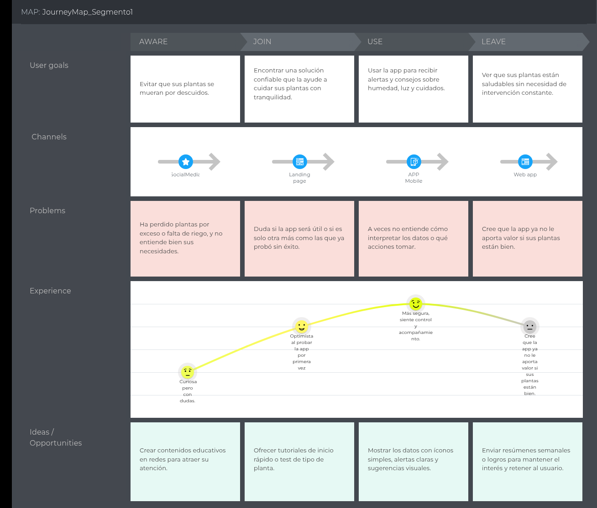

# Capítulo II: Requirements Elicitation & Analysis

La recolección y análisis de requisitos es una etapa fundamental en el desarrollo de cualquier proyecto. Este proceso implica identificar, comprender y documentar las necesidades y expectativas de los stakeholders, así como los objetivos y restriccionesdel proyecto. Mediante diversas técnicas como entrevistas, encuestas y talleres de trabajo colaborativo, se busca obtener una comprensión clara y detallada de lo que se espera lograr con el proyecto.

El análisis de estos requisitos permite establecer una base sólida para el diseño y desarrollo posterior, asegurando que el producto final satisfaga las necesidades del usuario y cumpla con los objetivos del negocio.

## 2.1. Competidores

En la siguiente sección se presentarán los competidores, un análisis de las fortalezas de nuestro servicio frente a estas.   

**Click and Grow Smart Garden:**   
   
Es una maceta inteligente enfocada en la jardinería automatizada con cápsulas especiales. Si bien facilita el cultivo en interiores, su enfoque está limitado a plantas específicas compatibles con su sistema propietario. Además, el costo de las cápsulas puede representar una barrera para el usuario promedio a largo plazo.

**Xiaomi Mi Flower Care Plant Sensor:**   
   
Es un sensor que monitorea ciertas variables de la planta como humedad, temperatura, luz y nutrientes. Sin embargo, su conectividad se limita a Bluetooth, lo que restringe el monitoreo en tiempo real si el usuario no está cerca. No incluye funciones como riego automático ni una solución completa de cuidado.

**Masdio Flowerpot:**   
   

Es una maceta decorativa con sensores básicos y luces LED integradas. Está más orientada a la estética y la decoración que al monitoreo técnico. Su funcionalidad es limitada y no ofrece datos detallados ni integración con plataformas web o móviles para un control más avanzado.

- ### 2.1.1. Análisis competitivo
  El análisis competitivo nos brinda una visión clara de cómo nos comparamos con nuestros competidores en el mercado. Nos
  ayuda a identificar áreas en las que podemos mejorar, así como oportunidades para diferenciarnos y destacar. Esta
  comprensión nos permite desarrollar estrategias más efectivas como grupo, lo que nos ayuda a alcanzar nuestros objetivos y
  mantenernos competitivos en el mercado.    

<table border="1" style="text-align: center;">
  <tbody>
    <tr>
      <td colspan="6"><strong>Competitive Analysis Landscape</strong></td>
    </tr>
    <tr>
      <td colspan="2"><strong>¿Por qué llevar a cabo este análisis?</strong></td>
      <td colspan="4">
        Llevar a cabo este análisis nos permitirá identificar las debilidades y vacíos que existen en los productos actuales,
        para así desarrollar una maceta inteligente más completa, funcional y adaptada a las necesidades reales de los usuarios.
      </td>
    </tr>
    <tr>
      <td colspan="2"></td>
      <td><strong>Click and Grow</strong></td>
      <td><strong>Xiaomi Mi Flower Care</strong></td>
      <td><strong>Masdio Flowerpot</strong></td>
    </tr>
    <tr>
      <td rowspan="2"><strong>Perfil</strong></td>
      <td>Overview</td>
      <td>Maceta inteligente con sistema cerrado que automatiza el cultivo de ciertas plantas mediante cápsulas y riego automático.</td>
      <td>Sensor portátil que mide humedad, luz, temperatura y nutrientes del suelo. Se conecta vía Bluetooth.</td>
      <td>Maceta decorativa con sensores básicos e iluminación LED, enfocada en interiores.</td>
    </tr>
    <tr>
      <td>Ventaja competitiva ¿Qué valor ofrece a los clientes?</td>
      <td>Permite cultivar fácilmente sin experiencia, ideal para hogares y espacios cerrados.</td>
      <td>Proporciona datos útiles para el cuidado de plantas mediante una app, sin necesidad de instalación compleja.</td>
      <td>Atractivo visual moderno con alertas básicas sobre nivel de agua y ambiente.</td>
    </tr>
    <tr>
      <td rowspan="2"><strong>Perfil de Marketing</strong></td>
      <td>Mercado objetivo</td>
      <td>Personas interesadas en cultivar en casa sin esfuerzo: familias, jóvenes urbanos.</td>
      <td>Usuarios que ya tienen plantas en casa y quieren monitorearlas mejor.</td>
      <td>Usuarios que buscan combinar tecnología y decoración en sus espacios interiores.</td>
    </tr>
    <tr>
      <td>Estrategias de marketing</td>
      <td>Promoción a través de redes sociales, influencers de estilo de vida y jardinería, y e-commerce.</td>
      <td>Promoción dentro del ecosistema Xiaomi, tiendas electrónicas y plataformas de reviews.</td>
      <td>Enfocado en diseño de interiores, se comercializa en tiendas de decoración y tecnología lifestyle.</td>
    </tr>
    <tr>
      <td rowspan="3"><strong>Perfil de Producto</strong></td>
      <td>Productos & Servicios</td>
      <td>Maceta inteligente, cápsulas con nutrientes, aplicación básica para monitoreo.</td>
      <td>Sensor portátil, app con base de datos de especies, sugerencias de cuidado.</td>
      <td>Maceta decorativa con sensores de humedad e iluminación ambiental.</td>
    </tr>
    <tr>
      <td>Precios & Costos</td>
      <td>Precio medio-alto; requiere comprar cápsulas constantemente.</td>
      <td>Bajo costo inicial, sin gastos adicionales; limitado a Bluetooth.</td>
      <td>Precio accesible, orientado más a decoración que funcionalidad completa.</td>
    </tr>
    <tr>
      <td>Canales de distribución (Web y/o Móvil)</td>
      <td>App móvil, tienda oficial y plataformas como Amazon.</td>
      <td>App móvil vía Bluetooth, disponible en tiendas Xiaomi y marketplaces.</td>
      <td>Distribución en tiendas de decoración, e-commerce y tiendas de gadgets.</td>
    </tr>
    <tr>
      <td rowspan="4"><strong>Análisis SWOT</strong></td>
      <td>Fortalezas</td>
      <td>
        <ul>
          <li>Fácil de usar, automatización completa.</li>
          <li>Diseño atractivo.</li>
        </ul>
      </td>
      <td>
        <ul>
          <li>Datos precisos y útiles sobre el estado de la planta.</li>
          <li>App bien integrada con base de datos.</li>
        </ul>
      </td>
      <td>
        <ul>
          <li>Diseño visual moderno, iluminación atractiva.</li>
          <li>Fácil instalación y uso.</li>
        </ul>
      </td>
    </tr>
    <tr>
      <td>Debilidades</td>
      <td>
        <ul>
          <li>Sistema cerrado con cápsulas propietarias.</li>
          <li>Poco personalizable.</li>
        </ul>
      </td>
      <td>
        <ul>
          <li>Solo funciona con Bluetooth (no es remoto).</li>
          <li>No tiene funciones de riego ni control físico.</li>
        </ul>
      </td>
      <td>
        <ul>
          <li>No ofrece monitoreo avanzado ni automatización real.</li>
          <li>Más decorativa que funcional.</li>
        </ul>
      </td>
    </tr>
    <tr>
      <td>Oportunidades</td>
      <td>
        <ul>
          <li>Expandirse con más tipos de cápsulas y conexión a apps.</li>
        </ul>
      </td>
      <td>
        <ul>
          <li>Integración con Wi-Fi o plataformas inteligentes como Alexa.</li>
        </ul>
      </td>
      <td>
        <ul>
          <li>Mejorar sensores y expandir hacia funciones de riego o monitoreo.</li>
        </ul>
      </td>
    </tr>
    <tr>
      <td>Amenazas</td>
      <td>
        <ul>
          <li>Altos precios de mantenimiento.</li>
          <li>Competidores más flexibles o abiertos.</li>
        </ul>
      </td>
      <td>
        <ul>
          <li>Obsolescencia si no se adapta a tecnologías inalámbricas modernas.</li>
        </ul>
      </td>
      <td>
        <ul>
          <li>Puede no ser percibido como un producto útil, sino decorativo.</li>
        </ul>
      </td>
    </tr>
  </tbody>
</table>

- ### 2.1.2. Estrategias y tácticas frente a competidores
  Para sobresalir frente a los competidores, es esencial implementar estrategias y tácticas que logren posicionar nuestro producto o servicio de manera diferenciada, atrayendo así el interés del público objetivo. Entre las posibles acciones a considerar se encuentran:   
- **Desarrollar una Propuesta de Valor Única**

  - **Estrategia:** Identificar y comunicar claramente el beneficio principal del producto: facilitar el cuidado de plantas mediante monitoreo en tiempo real y alertas personalizadas.
  - **Táctica:** Realizar encuestas a personas que tienen plantas en casa o departamentos para conocer sus principales dificultades al cuidarlas, y usar esa información para destacar funciones clave como el aviso automático de riego o la luz insuficiente.

- **Enfoque en la Experiencia del Usuario:**

  - **Estrategia:** Priorizar la facilidad de uso y la satisfacción desde la configuración del dispositivo hasta la visualización de los datos.
  - **Táctica:** Diseñar una app móvil y web intuitiva, y hacer pruebas de usabilidad con usuarios que no tengan conocimientos técnicos, asegurando que puedan usar la maceta sin complicaciones.

- **Ampliar la Base de Usuarios:**

  - **Estrategia:** Hacer el producto atractivo para distintos públicos, como amantes de las plantas, jardineros o usuarios con poco tiempo.
  - **Táctica:** Ofrecer descuentos por lanzamiento o una versión básica gratuita de la app para usuarios que quieran probar la funcionalidad sin comprar la maceta aún.

- **Marketing Digital Dirigido:**

  - **Estrategia:** Usar campañas digitales para llegar a personas interesadas en jardinería, decoración del hogar y tecnología para el hogar.
  - **Táctica:** Crear anuncios en redes sociales (Instagram, TikTok) mostrando cómo la maceta inteligente ayuda a mantener vivas las plantas sin esfuerzo, y segmentarlos a personas que siguen cuentas de jardinería o smart home.

- **Colaboraciones Estratégicas:**
  - **Estrategia:** Aliarse con tiendas de plantas, viveros o marcas de decoración para potenciar el alcance del producto.
  - **Táctica:** Formar convenios con viveros para ofrecer la maceta como parte de un “kit inteligente” al comprar una planta, o colaborar con influencers de plantas para demostrar su uso.

## 2.2. Entrevistas

El propósito de las entrevistas es adquirir una comprensión profunda de las experiencias, perspectivas y opiniones de los segmentos de mercado seleccionados. Nuestro objetivo es obtener información valiosa que nos ayude a entender mejor a nuestro público objetivo y así mejorar nuestro conocimiento sobre los usuarios. Estas conversaciones nos permitirán obtener una visión más clara de las necesidades y deseos de nuestros usuarios, lo que nos ayudará a adaptar nuestros productos o
servicios de manera más efectiva a sus requerimientos.

- ### 2.2.1. Diseño de entrevistas

    Información general del participante

    1. Nombre:
    2. Edad:
    3. Ubicación actual con provincia y distrito:
    4. Ocupación:
    5. Nivel de experiencia con plantas: [Principante, Intermedio, Avanzado]

* **Segmento 1: Personas apasionadas por las plantas**
      
    **Objetivo**: Explorar las motivaciones, hábitos, retos, y percepción de la tecnología de personas con un vínculo emocional fuerte con las plantas, ya sea en el hogar o en pequeños jardines.

    * Preguntas de exploración inicial (contexto general)

        1. ¿Podrías contarme cómo empezó tu interés por el cuidado de plantas?
    
        2. ¿Cuántas plantas cuidas actualmente y qué tipo de plantas prefieres (interior, exterior, comestibles, decorativas, etc.)?
    
        3. ¿Con qué frecuencia sueles dedicar tiempo al cuidado de tus plantas? ¿Tienes alguna rutina específica?

    * Preguntas de seguimiento y profundización ante la exploración inicial (Probes):

        4. ¿Qué haces exactamente durante ese tiempo?
    
        5. ¿Hay momentos del día o del año donde cuidas más de ellas?

    * Desafíos actuales y soluciones empleadas
      
        6. ¿Cuáles dirías que son los principales retos que enfrentas al cuidar tus plantas?
    
        7. ¿Has utilizado alguna herramienta, app o dispositivo tecnológico para ayudarte con el riego o monitoreo? ¿Cuál fue tu experiencia?
    
    * Actitud frente a la tecnología (antes de presentar el producto)
    
        8. ¿Qué te parecería contar con una maceta que pueda regar automáticamente tus plantas y monitorear su salud?
    
        9. ¿Qué beneficios imaginas que te podría ofrecer una maceta inteligente? ¿Y qué dudas o preocupaciones te generaría?
    
    * Reacción tras presentar el concepto de Macetech
    
      **Objetivo**: Validar aceptación, percepción de valor, integración en el estilo de vida, y disposición de pago.
    
        10. Después de conocer lo que hace nuestra maceta inteligente, ¿qué función te parece más útil o valiosa? ¿Por qué?
    
        11. ¿Considerarías esta maceta como una inversión en el cuidado de tus plantas o como un lujo? ¿Qué resultados esperas ver para sentir que fue una buena inversión?
    
    * Preguntas de seguimiento y profundización ante la presentación del concepto de Macetech (Probes):
    
        12. En una escala del 1 al 5, ¿qué tan dispuesto/a estarías a usar este tipo de tecnología con tus plantas? (1 = Nada dispuesto, 5 = Muy dispuesto)
    
        13. ¿Cómo imaginas que este dispositivo encajaría en tu hogar? ¿El diseño y tamaño serían importantes para ti?
    
        14. ¿Qué tan útil te parecería tener una app móvil o web para recibir notificaciones, ver métricas o controlar el riego?
    
        15. ¿Qué otras funciones o características te gustaría que tuviera Macetech para mejorar tu experiencia?

* **Segmento 2:** Personas dedicadas a la jardinería (profesional o semiprofesional)

    **Objetivo:** Identificar prácticas comunes, herramientas utilizadas, puntos de dolor críticos y percepción de valor funcional de una solución como Macetech en contextos más técnicos o comerciales.

    * Preguntas de contexto y rutina profesional
    
        1. ¿Cuántos años de experiencia tienes en jardinería? ¿Trabajas de forma independiente, en viveros, o en proyectos particulares?
        
        2. ¿Qué tipo de plantas manejas con más frecuencia? ¿Cuál es el volumen promedio de plantas que cuidas?
        
        3. ¿Podrías describirme cómo es tu proceso habitual de riego, fertilización y monitoreo?
    
    * Problemas y recursos actuales
    
        4. ¿Qué dificultades enfrentas hoy en el manejo de plantas (riego, clima, plagas, tiempo, recursos, etc.)?
        
        5. ¿Utilizas actualmente alguna tecnología para ayudarte con estas tareas? ¿Qué tan útil ha sido?
    
    * Preguntas de seguimiento y profundización ante las preguntas de contexto y rutina profesional (Probes):
    
        6. ¿Qué te funciona bien hoy?
        
        7. ¿Qué te gustaría que funcione mejor?
        
    * Expectativas y percepción frente a soluciones inteligentes
    
        8. Si tuvieras un sistema automatizado que controle riego, humedad y nutrientes, ¿cuál de estas variables te sería más crítica monitorear?
        
        9. ¿Qué tan importante sería para ti poder visualizar toda esta información desde una plataforma web o móvil?
        
        10. ¿Preferirías un sistema que simplemente automatice tareas o uno que te brinde recomendaciones y control manual?
    
    * Reacción ante Macetech
    
        11. Luego de conocer nuestra maceta inteligente, ¿qué opinas sobre su utilidad práctica en tu trabajo diario?
        
        12. ¿Qué características crees que deben mejorarse o incluirse para ser realmente útil a nivel profesional?
        
        13. En una escala del 1 al 5, ¿qué tan probable es que consideres adoptar este tipo de tecnología como parte de tus herramientas de jardinería?
        
        14. ¿Qué elementos influirían más en tu decisión de compra (precio, ahorro de agua, menor carga de trabajo, confiabilidad)?
        
        15. ¿Cuánto estarías dispuesto a pagar por una unidad como esta, considerando su funcionalidad y durabilidad?

- ### 2.2.2. Registro de entrevistas

  El registro de entrevistas es una herramienta fundamental que nos ayuda a recopilar y organizar la información obtenida durante las entrevistas con nuestros usuarios o clientes. Nos permite documentar de manera estructurada las respuestas, comentarios y observaciones relevantes, lo que facilita su análisis posterior y la identificación de patrones o tendencias. Además, nos proporciona un registro histórico de las interacciones con los usuarios, lo que nos ayuda a mantenernos alineados con sus necesidades y expectativas a lo largo del tiempo.  

  [Entrevistas](https://upcedupe-my.sharepoint.com/:v:/g/personal/u202218996_upc_edu_pe/EZRjMMx5nt9Iq_XFp4HD2BwBvPbnMSu6UMO4lDyx8cy1iA?e=gUpCHa&nav=eyJyZWZlcnJhbEluZm8iOnsicmVmZXJyYWxBcHAiOiJTdHJlYW1XZWJBcHAiLCJyZWZlcnJhbFZpZXciOiJTaGFyZURpYWxvZy1MaW5rIiwicmVmZXJyYWxBcHBQbGF0Zm9ybSI6IldlYiIsInJlZmVycmFsTW9kZSI6InZpZXcifX0%3D)

  
  #### **Segmento 1 - Personas Apasionadas por las plantas:**

  ***

  - ### **Entrevista #1**

    Nombre y apellidos: Andres Torres  
    Edad: 21 años  
    Distrito: Lince  
      
    **Resumen De Entrevista**  
    El entrevistado, Andrés, tiene un fuerte interés por las plantas desde su niñez, lo que lo ha llevado a cuidarlas de forma constante a lo largo de su vida. Disfruta especialmente ver su desarrollo y mantenerlas saludables, aunque reconoce que a veces tiene dificultades para saber cuándo regarlas correctamente, lo que ha causado la pérdida de algunas. Actualmente no utiliza herramientas tecnológicas para su cuidado, y se guía principalmente por su experiencia y búsquedas ocasionales en internet. Al conocer la propuesta de una maceta inteligente, mostró interés, resaltando que valoraría recibir alertas claras y que el sistema sea sencillo de usar. Considera que, si tiene un precio accesible y ayuda a prevenir errores, podría ser una inversión útil. También mencionó que el diseño debería integrarse bien con su hogar, y se mostró interesado en funciones como la integración con una app móvil, recomendaciones según el tipo de planta y un registro de seguimiento del estado de cada una.    

    **Tiempo de Entrevista** 
    **Inicio: 00:00**  
    **Fin: 6:22**
  
  - ### **Entrevista #2**

    Nombre y apellidos: Sirley Zapata  
    Edad: 54 años  
    Región: Cajamarca  
      
    **Resumen De Entrevista**  
    La entrevistada, Sirley, actualmente no utiliza dispositivos tecnológicos para el cuidado de sus plantas, basándose principalmente en su experiencia personal y en la búsqueda de información, especialmente a través de videos y Google. Al conocer la idea de una maceta inteligente, expresó su interés, destacando que valoraría recibir alertas claras y que el sistema fuera fácil de usar. Considera que si el precio fuera accesible y el producto ayudara a evitar errores en el cuidado, sería una inversión que valdría la pena. Además, comentó que el diseño de la maceta debería armonizar con la decoración de su hogar, y mostró interés por características como la integración con una aplicación móvil, recomendaciones personalizadas según el tipo de planta y la posibilidad de llevar un registro del estado de cada una.   

    **Tiempo de Entrevista**
    **Inicio: 14:51**  
    **Fin: 22:52**
  - ### **Entrevista #3**
    Nombre y apellidos: Rosalinda Quispe  
    Edad: 43 años  
    Región: Lima  
      
    **Resumen De Entrevista**  
    La entrevistada, Rosalinda...   

    **Tiempo de Entrevista**
    **Inicio: 48:55**  
    **Fin: 57:30**

#### **Segmento 2:** Personas dedicadas a la jardinería 
  
  - ### **Entrevista #1**

    Nombre y apellidos: Yasser Renteria  
    Edad: 25 años  
    Distrito: Chorrillos  
      
    **Resumen De Entrevista**  
    El entrevistado, Yasser, ha trabajado de forma independiente en jardinería desde los 20 años. Él cuenta con 250 plantas a su cuidado, mayormente, ornamentales y aromáticas. Sobre el cuidado de sus plantas, Yasser describe un proceso principalmente manual y basado en la observación. Realiza una inspección diaria de sus 200-250 plantas. El riego se efectúa aproximadamente 2 a 3 veces por semana por la mañana, ajustando la frecuencia y la cantidad según las condiciones climáticas y las necesidades percibidas de las plantas. La fertilización es orgánica y se aplica con una frecuencia quincenal. Para el monitoreo, confía en su observación constante, a menudo a lo largo del día o semanalmente, basándose en su experiencia para identificar signos de problemas. El entrevistado muestra un gran interés en la tecnología y la automatización para facilitar su trabajo. Valora la información en tiempo real y la posibilidad de monitorear variables clave como el suelo y el agua. La confiabilidad y la durabilidad son factores cruciales en su decisión de compra, y está dispuesto a invertir en el producto si el precio es adecuado, especialmente para un volumen grande de plantas.    
    **Tiempo de Entrevista**
    **Inicio: 06:23**  
    **Fin: 14:51**
  - ### **Entrevista #2**
    Nombre y apellidos: Javier Hernandez  
    Edad: 27 años  
    Distrito: Lince  
      
    **Resumen De Entrevista**  
    El entrevistado ...    
    **Tiempo de Entrevista**
    **Inicio: 22:53**  
    **Fin: 33:47**
  - ### **Entrevista #3**
    Nombre y apellidos: Betty Magdalena Chumacero  
    Edad: 62 años  
    Distrito: San Juan de Miraflores  
      
    **Resumen De Entrevista**  
    La entrevistada ...    
    **Tiempo de Entrevista**
    **Inicio: 33:47**  
    **Fin: 33:47**

- ### 2.2.3. Análisis de entrevistas

En general, todos los entrevistados expresaron interés en el uso de una maceta inteligente, especialmente si esta facilita el proceso de cuidado, ofrece recomendaciones personalizadas y se integra bien con sus hogares. La accesibilidad del precio y la capacidad de evitar errores en el cuidado de las plantas son factores comunes en la toma de decisiones de compra. Sin embargo, la disposición para invertir en tecnología varía según el volumen de plantas que cada uno maneja, así como el nivel de experiencia y el enfoque que tienen hacia el cuidado de las plantas.

## 2.3. Needfinding

El proceso de needfinding nos permite identificar problemas reales que enfrentan los usuarios y descubrir oportunidades de diseño que pueden llevar a soluciones innovadoras y centradas en el usuario.

- ### 2.3.1. User Personas

  En esta sección, presentaremos el perfil de nuestros User Persona, que surge de un análisis de las entrevistas realizadas anteriormente y de una evaluación de la competencia en el mercado. Los artefactos que vamos a presentar están estrechamente relacionados con las principales características identificadas durante este proceso de análisis. Desde las entrevistas, hemos extraído valiosa información sobre las necesidades, deseos y frustraciones de nuestros potenciales usuarios, lo que nos ha permitido perfilar a nuestro User Persona de manera precisa y realista.   

  - **Segmento 1: Personas Apasionadas por las plantas**
       

  - **Segmento 2: Personas dedicadas a la jardineria**
       

- ### 2.3.2. User Task Matrix

  La User Task Matrix es una herramienta que nos permite identificar las tareas clave que nuestros usuarios necesitan realizar en nuestra aplicación web y móbil. Al mapear estas tareas, podemos comprender mejor las necesidades y expectativas de nuestros usuarios, lo que nos ayuda a diseñar una experiencia de usuario más efectiva y centrada en sus requerimientos.
    
  <table style="text-align: center; width: 100%;">
    <thead>
      <tr>
        <th rowspan="2">Tareas</th>
        <th colspan="2">Personas apasionadas por las plantas</th>
        <th colspan="2">Personas que trabajan en jardinería</th>
      </tr>
      <tr>
        <th>Frecuencia</th>
        <th>Importancia</th>
        <th>Frecuencia</th>
        <th>Importancia</th>
      </tr>
    </thead>
    <tbody>
      <tr>
        <td>Regar sus plantas</td>
        <td>Often</td>
        <td>High</td>
        <td>Daily</td>
        <td>High</td>
      </tr>
      <tr>
        <td>Revisar si las plantas tienen suficiente luz</td>
        <td>Sometimes</td>
        <td>Medium</td>
        <td>Always</td>
        <td>High</td>
      </tr>
      <tr>
        <td>Consultar sobre el cuidado de una planta específica</td>
        <td>Often</td>
        <td>High</td>
        <td>Sometimes</td>
        <td>Medium</td>
      </tr>
      <tr>
        <td>Tomar fotos de sus plantas para monitoreo o redes</td>
        <td>Sometimes</td>
        <td>Medium</td>
        <td>Rarely</td>
        <td>Low</td>
      </tr>
      <tr>
        <td>Registrar en qué estado está cada planta</td>
        <td>Rarely</td>
        <td>Medium</td>
        <td>Sometimes</td>
        <td>High</td>
      </tr>
      <tr>
        <td>Identificar cuándo una planta está en mal estado</td>
        <td>Often</td>
        <td>High</td>
        <td>Always</td>
        <td>High</td>
      </tr>
      <tr>
        <td>Revisar manualmente el nivel de humedad del suelo</td>
        <td>Sometimes</td>
        <td>Medium</td>
        <td>Daily</td>
        <td>High</td>
      </tr>
      <tr>
        <td>Comprar productos o herramientas para plantas</td>
        <td>Monthly</td>
        <td>Medium</td>
        <td>Weekly</td>
        <td>Medium</td>
      </tr>
      <tr>
        <td>Monitorear múltiples plantas al mismo tiempo</td>
        <td>Sometimes</td>
        <td>High</td>
        <td>Always</td>
        <td>High</td>
      </tr>
      <tr>
        <td>Probar nuevas formas de mejorar el cuidado de las plantas</td>
        <td>Often</td>
        <td>Medium</td>
        <td>Sometimes</td>
        <td>High</td>
      </tr>
      <tr>
        <td>Usar apps web o móviles para llevar seguimiento de sus plantas</td>
        <td>Rarely</td>
        <td>Low</td>
        <td>Never</td>
        <td>Low</td>
      </tr>
    </tbody>
  </table>

- ### 2.3.3. User Journey Mapping

  El User Journey Mapping es una herramienta para comprender la experiencia del usuario de manera holística, lo que permite a los equipos de diseño crear productos y servicios que se alineen mejor con las necesidades y expectativas de los usuarios.  

  - **Segmento 1: Personas Apasionadas por las plantas**
       

  - **Segmento 2: Personas dedicadas a la jardineria**
    

- ### 2.3.4. Empathy Mapping

  Se ha elaborado el Empathy Mapping utilizando los datos obtenidos de las etapas preliminares del proyecto. A través de este proceso, hemos diseñado mapas específicos para cada uno de nuestros dos User Persona, con el fin de profundizar en la comprensión de sus necesidades y experiencias. Esta comprensión es esencial para guiar las próximas fases de nuestro desarrollo.   

  - **Segmento 1: Personas Apasionadas por las plantas**
       

  - **Segmento 2: Personas dedicadas a la jardineria**
    

- ### 2.3.5. As-is Scenario Mapping

  El "As-is Scenario Mapping" será una parte fundamental de nuestro enfoque de trabajo, ya que nos permitirá comprender el estado actual de nuestros procesos, identificar áreas de mejora y visualizar los pasos necesarios para alcanzar nuestros objetivos.  

  - **Segmento 1: Personas Apasionadas por las plantas**
       

  - **Segmento 2: Personas dedicadas a la jardineria**
    

## 2.4. Ubiquitous Language

| **Término**                  | **Definición breve**                                                            |
| ---------------------------- | ------------------------------------------------------------------------------- |
| **Maceta Inteligente**       | Dispositivo con sensores que monitorea el estado de una planta en tiempo real.  |
| **Sensor de Humedad**        | Detecta cuánta agua hay en la tierra.                                           |
| **Sensor de Luz**            | Mide la cantidad de luz que recibe la planta.                                   |
| **Notificación Inteligente** | Alerta automática que indica si la planta necesita cuidados (riego, luz, etc.). |
| **Dashboard**                | Pantalla principal que muestra el estado actual de las plantas.                 |
| **Usuario Doméstico**        | Persona que cuida plantas en casa (como Laura).                                 |
| **Usuario Profesional**      | Jardinero que cuida plantas de varios clientes (como Carlos).                   |
| **App Móvil**                | Aplicación usada en el celular para monitorear o recibir alertas.               |
| **App Web**                  | Plataforma usada para gestionar múltiples plantas y ver reportes.               |
| **Estado de la Planta**      | Clasificación visual (saludable, necesita agua, poca luz, etc.).                |
