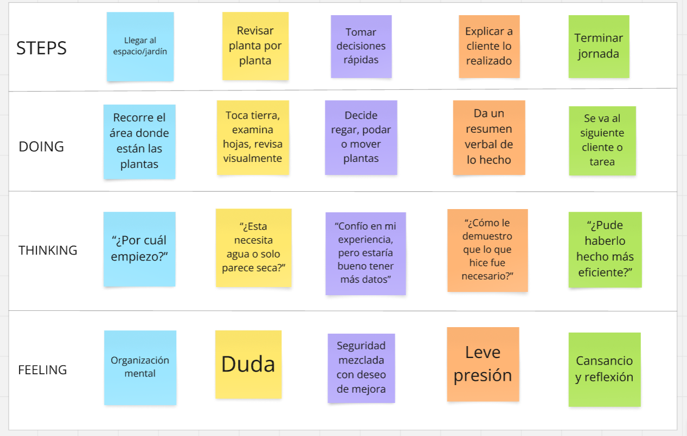

# Capítulo II: Requirements Elicitation & Analysis

La recolección y el análisis de requisitos constituyen la piedra angular de cualquier proyecto exitoso. En esta fase se identifican y documentan, de manera sistemática, las necesidades, expectativas y restricciones de todos los grupos de interés (stakeholders), así como los objetivos de negocio que el proyecto debe cumplir. Para lograrlo, se emplean técnicas como entrevistas individuales, encuestas cuantitativas, talleres colaborativos y análisis de la competencia, que permiten obtener una visión integral y detallada de lo que se desea alcanzar.

Un análisis riguroso de estos requisitos proporciona una base firme para el diseño y desarrollo posteriores, minimiza retrabajos y alineaciones erróneas, y garantiza que la solución final no solo satisfaga las necesidades reales de los usuarios, sino que también aporte valor al negocio. De este modo, se establecen criterios claros de éxito y se facilita la toma de decisiones a lo largo de todo el ciclo de vida del proyecto, optimizando recursos y tiempos.

## 2.1. Competidores

Nuestro proyecto se centra en el desarrollo de Macetech, una solución de jardinería inteligente que integra hardware y software para ofrecer a los usuarios un cuidado de plantas completamente automatizado y personalizado. Gracias a sensores IoT avanzados y a una plataforma móvil y web intuitiva, Macetech monitorea en tiempo real variables clave (humedad del sustrato, temperatura, luz, pH) y activa un sistema de riego automatizado, además de brindar alertas y recomendaciones basadas en algoritmos de IA.

Partiendo de estas capacidades innovadoras, hemos identificado y analizado a los principales competidores que podrían desafiar nuestra propuesta en el mercado de jardinería doméstica inteligente. Estas empresas representan una amenaza potencial para la adopción y crecimiento de Macetech, ya que cuentan con trayectoria en dispositivos conectados, equipos multidisciplinarios y recursos para escalar rápidamente. A continuación, presentamos los competidores más relevantes y sus puntos fuertes:

**Click and Grow Smart Garden:** 

Página web principal: https://uk.clickandgrow.com/?srsltid=AfmBOop4Wmi3FQCFLOLnTW9ZWkDObAN6YCZseEiBAu6hL1T1ov6BtDX1 

   

Click & Grow es una compañía estoniana fundada en 2009 por Mattias Lepp y sus colegas, con sede en Tartu, Estonia. Su misión es llevar la jardinería a hogares de todo el mundo mediante sistemas de cultivo inteligentes y de bajo mantenimiento.

Desde su lanzamiento, Click & Grow ha popularizado el concepto de “jardín de interior” automatizado. Para 2023, la empresa había vendido más de 500 000 unidades en más de 70 países, consolidándose como uno de los líderes del mercado de jardinería doméstica inteligente.

Su propuesta de valor se sustenta en los siguientes componentes y funcionalidades:

* **Cartuchos de cultivo patentados (“plant pods”):** Cápsulas presembradas con semillas, sustrato y nutrientes balanceados que simplemente se insertan en la unidad y garantizan un crecimiento óptimo sin necesidad de trasplantes ni fertilizantes adicionales.

* **Sistema de riego automático por capilaridad:** Un depósito de agua integrado suministra humedad de forma constante a las raíces de las plantas mediante mechas capilares, evitando tanto el encharcamiento como la sequía.

* **Iluminación LED de espectro optimizado:** Lámparas de LED que emulan la luz solar necesaria en cada fase de crecimiento, programadas para ciclos de 16 horas de luz y 8 de oscuridad, maximizando la fotosíntesis.

* **Plataforma de gestión móvil:** Una aplicación (iOS/Android) permite supervisar el nivel de agua, la fase de crecimiento de cada planta y recibir notificaciones para rellenar el depósito o cambiar los cartuchos.

* **Variedad de kits temáticos:** Desde hierbas culinarias y flores ornamentales hasta microgreens y plantas aromáticas, con más de 60 tipos de “plant pods” disponibles.

* **Diseño modular y escalable:** Las unidades se pueden interconectar para crear jardines más grandes, adaptándose a diferentes espacios y necesidades estéticas.

* **Sostenibilidad y conveniencia:** El sistema está diseñado para minimizar el uso de agua (hasta un 90 % menos que el riego convencional) y reducir los desperdicios de nutrientes, al tiempo que facilita la experiencia a usuarios sin conocimientos previos de jardinería.

Gracias a su enfoque *plug & play*, Click & Grow atrae a consumidores que buscan combinar tecnología y naturaleza en el hogar sin dedicar tiempo a tareas de mantenimiento complejas. No obstante, su dependencia de cartuchos específicos y la falta de sensores de calidad del aire o la temperatura ambiental constituyen áreas donde soluciones como Macetech pueden diferenciarse.

**Xiaomi Mi Flower Care Plant Sensor:**

Página web de venta: https://www.amazon.es/Flower-Care-fertilidad-feuchtigkeitsgrad-temperatur/dp/B01MUDQD8I

   

Xiaomi Mi Flower Care es un dispositivo de la línea *Mi Ecosystem*, lanzado en 2017 por la filial Xiaomi Youpin, con sede en Beijing, China. Su objetivo es ofrecer un sensor compacto y asequible para el cuidado de plantas de interior, integrándose al ecosistema Mi Home de Xiaomi.

A la fecha, Xiaomi ha distribuido más de 1 millón de unidades mundialmente, destacándose por su excelente relación calidad-precio y fácil integración con otros dispositivos inteligentes del hogar.

Principales características y funcionalidades:

* **Sensores multiparámetro:** Mide humedad del suelo, temperatura ambiental, intensidad de luz y fertilidad del sustrato utilizando un sensor de conductividad eléctrica (EC).

* **Conectividad Bluetooth:** Se conecta vía Bluetooth BLE a la aplicación Mi Home (iOS/Android), donde se muestran gráficas históricas y alertas de cuidado.

* **Batería de larga duración:** Funciona con una pila CR2 reemplazable, con autonomía aproximada de 4 a 6 meses según uso y entorno.

* **Alertas y recomendaciones:** La app notifica cuándo regar, cuándo aportar fertilizante y si la planta sufre estrés por luz o temperatura, basándose en umbrales preconfigurados para diversas especies.

* **Compatibilidad con Mi Home:** Permite crear automatizaciones (por ejemplo, encender luces de cultivo o activar sistemas de riego conectados al ecosistema Xiaomi) y agrupar múltiples sensores en escenas inteligentes.

* **Diseño minimalista:** Carcasa plástica blanca con varilla metálica de inserción en el sustrato y un indicador LED que cambia de color ante alertas críticas.

* **Amplia base de datos de plantas:** La app incluye más de 1 000 especies registradas, con rangos de óptimos de humedad, luz y nutrientes para cada una.

Xiaomi Mi Flower Care destaca por democratizar el monitoreo ambiental en jardinería doméstica a bajo costo. Sin embargo, carece de un sistema de riego automático integrado y de conectividad Wi-Fi directa, lo que limita el control remoto sin puente BLE. Soluciones como Macetech pueden diferenciarse al combinar sensores avanzados con riego automatizado y conectividad continua a Internet sin hardware adicional.

**Masdio Flowerpot:**

Página web principal: https://masdio.com/products/masdio-ivy-smart-flowerpots?srsltid=AfmBOoq5XFcFZDC3qflRMSbY0cfU3VHAFg-Ostn8YsCG320rDy-xm6KE 

   

Masdio es una startup española que en 2023 lanzó la maceta inteligente Ivy Smart Flowerpot, diseñada para cultivo de interior con enfoque en diseño minimalista y conectividad integral. Se distribuye en Europa y Latinoamérica a través de su web y partners de decoración.

Principales características y funcionalidades:

* **Diseño modular y estético:** Con acabado cerámico mate y variedad de colores, incluye soporte de madera natural para integrarse a cualquier ambiente de hogar u oficina.

* **Sensores integrados:** Mide humedad del sustrato, temperatura y luz ambiental mediante sensores de alta precisión.

* **Aviso y notificaciones de riego:** Cuando los sensores de humedad indican muy bajos niveles, la maceta le pasará una notificación a la aplicación la cual luego se le presentará al usuario para que pueda actuar ante tal riesgo con facilidad y rapidez.

* **Conectividad Wi-Fi y Bluetooth:** Se conecta a la app Masdio (iOS/Android) vía Wi-Fi 2.4 GHz; BLE actúa como fallback local si la señal fluctúa.

* **App Masdio:** Ofrece vistas en tiempo real, historial de datos, notificaciones push (riego, luz insuficiente, temperatura extrema) y consejos para más de 500 especies.

* **Integración con asistentes:** Compatible con Amazon Alexa y Google Assistant para consultas de voz como “¿Cuánta agua necesita mi planta?”

* **Fácil montaje y limpieza:** Sistema plug-and-play sin herramientas; componentes desmontables aptos para lavado manual.

Macetech puede superar a Ivy Smart Flowerpot al ofrecer depósito de mayor capacidad flexible según modelo, sensores avanzados de pH y salinidad, plataforma abierta de datos IoT (no propietaria), y algoritmos de recomendación basados en aprendizaje automático para diagnóstico de enfermedades.

### 2.1.1. Análisis competitivo
El análisis competitivo nos brinda una visión clara de cómo nos comparamos con nuestros competidores en el mercado. Nos ayuda a identificar áreas en las que podemos mejorar, así como oportunidades para diferenciarnos y destacar. Esta comprensión nos permite desarrollar estrategias más efectivas como grupo, lo que nos ayuda a alcanzar nuestros objetivos y mantenernos competitivos en el mercado.    

###### Tabla 4
*Análisis Competitivo organizado para todos los competidores potenciales de Macetech*

<table border="1" style="text-align: center;">
  <tbody>
    <tr>
      <td colspan="6"><strong>Competitive Analysis Landscape</strong></td>
    </tr>
    <tr>
      <td colspan="2"><strong>¿Por qué llevar a cabo este análisis?</strong></td>
      <td colspan="4">
        Este análisis nos ayudará a detectar las carencias y brechas de los productos actuales, para diseñar una maceta inteligente más completa, práctica y alineada con las necesidades reales de los usuarios.
      </td>
    </tr>
    <tr>
      <td colspan="2"></td>
      <td><strong>Macetech</strong></td>
      <td><strong>Click and Grow</strong></td>
      <td><strong>Xiaomi Mi Flower Care</strong></td>
      <td><strong>Masdio Flowerpot</strong></td>
    </tr>
    <tr>
      <td rowspan="2"><strong>Perfil</strong></td>
      <td>Overview</td>
      <td>Maceta inteligente de arquitectura abierta, con sensores avanzados de humedad, pH, conductividad y luz; sistema de riego autónomo controlado por IA; y plataforma web y móvil que combina análisis de datos, reportes de salud vegetal y recomendaciones personalizadas basadas en perfil de especie y del usuario.</td>
      <td>Sistema de cultivo automatizado que emplea cápsulas de nutrientes premezclados y un depósito de agua cerrado. Gestiona automáticamente el riego, la aireación y la nutrición para una variedad de hierbas y hortalizas, garantizando condiciones óptimas sin intervención diaria.</td>
      <td>Dispositivo compacto equipado con sensores de humedad, luminosidad, temperatura y conductividad eléctrica del suelo. Transmite datos en tiempo real mediante Bluetooth a una aplicación móvil, permitiendo diagnósticos precisos y alertas en el smartphone del usuario.</td>
      <td>Maceta inteligente con diseño modular e iluminación LED integrada. Incluye sensores básicos de humedad y temperatura, y ofrece programación de escenas lumínicas para realzar el valor decorativo de las plantas en interiores.</td>
    </tr>
    <tr>
      <td>Ventaja competitiva ¿Qué valor ofrece a los clientes?</td>
      <td>Integra un sistema de riego inteligente impulsado por IOT y un conjunto de sensores multidimensionales que no solo monitorizan parámetros clave, sino que detectan problemas en la planta vía algoritmos de aprendizaje automático y sugieren acciones preventivas o correctivas específicas para cada especie.</td>
      <td>Simplifica por completo la jardinería al eliminar la necesidad de conocimiento técnico; sus cápsulas estandarizadas reducen el margen de error en la dosificación de nutrientes y su autonomía prolongada facilita la práctica a usuarios muy ocupados.</td>
      <td>Proporciona lecturas ambientales de alta precisión, permitiendo al aficionado tomar decisiones informadas y remotas sobre riego y ubicación de plantas sin instalaciones complejas.</td>
      <td>Combina tecnología y diseño interior, ofreciendo una experiencia sensorial a través de iluminación personalizable y alertas visuales sobre niveles de agua, lo que mejora tanto la estética como la usabilidad en espacios de vivienda y oficina.</td>
    </tr>
    <tr>
      <td rowspan="2"><strong>Perfil de Marketing</strong></td>
      <td>Mercado objetivo</td>
      <td>Jardineros nuevos y profesionales de paisajismo en entornos urbanos, que requieren una plataforma integral de IoT para gestionar múltiples plantas, optimizar recursos hídricos y energéticos, y recibir asesoramiento botánico personalizado en tiempo real.</td>
      <td>Hogares urbanos y familias que buscan cultivar alimentos frescos sin curva de aprendizaje, valorando la conveniencia y el diseño compacto.</td>
      <td>Aficionados a la jardinería doméstica que ya poseen plantas y desean herramientas de precisión para optimizar su cuidado mediante datos.</td>
      <td>Usuarios interesados en tecnología de estilo de vida y decoración inteligente, que buscan un complemento estético con funcionalidad básica de monitoreo.</td>
    </tr>
    <tr>
      <td>Estrategias de marketing</td>
      <td>Marketing digital dirigido a jardineros urbanos y profesionales de paisajismo, con contenido educativo en redes, webinars de “jardinería inteligente” y alianzas con viveros.</td>
      <td>Campañas en redes sociales, colaboración con influencers de jardinería y estilo de vida saludable, y venta a través de e-commerce especializado en hogar y cocina.</td>
      <td>Promoción dentro del ecosistema Xiaomi, alianzas con tiendas de electrónica y reseñas en plataformas tech, reforzadas por demostraciones en puntos de venta físicos.</td>
      <td>Enfoque en comunidades de diseño de interiores y decoración, con presencia en boutiques de lifestyle, ferias de diseño y colaboraciones con revistas especializadas.</td>
    </tr>
    <tr>
      <td rowspan="3"><strong>Perfil de Producto</strong></td>
      <td>Productos & Servicios</td>
      <td>Maceta inteligente con sensores de humedad, pH, conductividad y luz, riego automatizado ajustado al perfil de la planta, y plataforma móvil/web para visualización de datos.</td>
      <td>Maceta inteligente con cápsulas de nutrientes premezclados y sistema cerrado de riego automático.</td>
      <td>Sensor portátil que mide humedad, luz, temperatura y conductividad, con app de recomendaciones personalizadas.</td>
      <td>Maceta decorativa con sensores básicos de humedad e iluminación LED ambiental.</td>
    </tr>
    <tr>
      <td>Precios & Costos</td>
      <td>Precio alto, cubre hardware completo y garantiza un margen bruto ≥35 %; sin consumibles obligatorios.</td>
      <td>Precio medio-alto, con modelo de negocio basado en venta recurrente de cápsulas de cultivo.</td>
      <td>Bajo costo inicial, sin suscripciones ni consumibles, solo mantenimiento de baterías.</td>
      <td>Precio accesible, orientado a la decoración; costos reducidos en sensores básicos y carcasas.</td>
    </tr>
    <tr>
      <td>Canales de distribución (Web y/o Móvil)</td>
      <td>Venta directa en nuestro e-commerce, canales B2B (viveros y paisajistas) y plataformas de jardinería urbana.</td>
      <td>App móvil de control, tienda online oficial y marketplaces como Amazon.</td>
      <td>Integración con app Mi Home, venta en tiendas Xiaomi, grandes retailers y marketplaces.</td>
      <td>Comercio electrónico en tiendas de decoración y gadgets, con presencia en e-commerce de nicho.</td>
    </tr>
    <tr>
      <td rowspan="4"><strong>Análisis SWOT</strong></td>
      <td>Fortalezas</td>
      <td>
        <ul>
          <li>Monitoreo integral (humedad, pH, conductividad, luz) y riego totalmente automatizado.</li>
          <li>Plataforma web/móvil con visualizaciones detalladas y recomendaciones personalizadas.</li>
        </ul>
      </td>
      <td>
        <ul>
          <li>Cultivo “plug & play” con cápsulas premezcladas y sistema cerrado de riego.</li>
          <li>Diseño minimalista y fácil de usar en interiores.</li>
        </ul>
      </td>
      <td>
        <ul>
          <li>Datos precisos en tiempo real sobre múltiples parámetros (humedad, luz, temperatura).</li>
          <li>App con base de datos de especies y sugerencias.</li>
        </ul>
      </td>
      <td>
        <ul>
          <li>Estética moderna con iluminación LED ambiental.</li>
          <li>Instalación inmediata y bajo mantenimiento.</li>
        </ul>
      </td>
    </tr>
    <tr>
      <td>Debilidades</td>
            <td>
        <ul>
          <li>Precio alto que puede limitar adopción.</li>
          <li>Dependencia de conectividad estable y calibración periódica de sensores.</li>
        </ul>
      </td>
      <td>
        <ul>
          <li>Sistema propietario de cápsulas genera costos recurrentes.</li>
          <li>Personalización limitada a las plantas compatibles.</li>
        </ul>
      </td>
      <td>
        <ul>
          <li>Alcance limitado a Bluetooth, sin control remoto ni riego automático.</li>
          <li>Sin consumibles, pero sin funciones de acción sobre la planta.</li>
        </ul>
      </td>
      <td>
        <ul>
          <li>Funcionalidad de monitoreo muy básica.</li>
          <li>Ausencia de automatización real; utilidad mayormente decorativa.</li>
        </ul>
      </td>
    </tr>
    <tr>
      <td>Oportunidades</td>
            <td>
        <ul>
          <li>Posibilidad de ampliar la línea con módulos adicionales (fertilizantes, sensores de CO₂).</li>
          <li>Integración con asistentes de voz y ecosistemas smart home.</li>
        </ul>
      </td>
      <td>
        <ul>
          <li>Expansión a más especies y tipos de cápsulas.</li>
          <li>Conexión con apps de terceros y plataformas de e-commerce.</li>
        </ul>
      </td>
      <td>
        <ul>
          <li>Evolución a Wi-Fi o NB-IoT para supervisión remota.</li>
          <li>Integración con ecosistemas inteligentes (Alexa, Google Home)..</li>
        </ul>
      </td>
      <td>
        <ul>
          <li>Incorporación de sensores adicionales y mini-riegos automáticos.</li>
          <li>Colaboraciones con marcas de interiorismo.</li>
        </ul>
      </td>
    </tr>
    <tr>
      <td>Amenazas</td>
            <td>
        <ul>
          <li>Competencia de soluciones más económicas o DIY.</li>
          <li>Fallos en hardware o calibración pueden erosionar la confianza del usuario.</li>
        </ul>
      </td>
      <td>
        <ul>
          <li>Costos de mantenimiento elevados por cápsulas.</li>
          <li>Presión de competidores con modelos abiertos y kits genéricos.</li>
        </ul>
      </td>
      <td>
        <ul>
          <li>Rápida obsolescencia si no añade funciones de acción remota.</li>
          <li>Competencia de sensores individuales con más conectividad.</li>
        </ul>
      </td>
      <td>
        <ul>
          <li>Percepción de producto meramente estético.</li>
          <li>Dificultad para justificar precio frente a macetas decorativas sin tecnología real.</li>
        </ul>
      </td>
    </tr>
  </tbody>
</table>

- ### 2.1.2. Estrategias y tácticas frente a competidores
Para destacar frente a competidores y consolidar nuestra posición en el mercado de jardinería inteligente, resulta imprescindible diseñar e implementar un conjunto de estrategias y tácticas coordinadas que refuercen nuestra diferenciación y capten la atención de los segmentos objetivo. A continuación, se presentan las principales líneas de acción:

- **Desarrollo de una Propuesta de Valor Distintiva**

    **Estrategia:** Precisar y articular el beneficio central de Macetech: la provisión de un sistema de cuidado de plantas verdaderamente autónomo, basado en monitoreo continuo de variables críticas (humedad, temperatura, pH, conductividad y luz) y en el envío de alertas contextuales.

    **Táctica:** Conducir estudios cualitativos y cuantitativos —entrevistas estructuradas, encuestas y focus groups— con usuarios residenciales de diversos perfiles (urbanos con balcones, oficinas, universidades) para mapear sus principales frustraciones y expectativas. A partir de los hallazgos, enfatizar en nuestros materiales de comunicación características como el disparo automático de riego al superar umbrales críticos de humedad y las recomendaciones inteligentes de iluminación.

- **Optimización de la Experiencia de Usuario (UX)**

    **Estrategia:** Garantizar una curva de aprendizaje mínima, así como una interacción fluida desde la instalación inicial del dispositivo hasta la consulta diaria de datos, alineada con los principios de diseño centrado en el usuario y el minimalismo funcional.

    **Táctica:** Desarrollar prototipos de la interfaz móvil y web empleando metodologías Agile y Design Thinking; realizar múltiples rondas de pruebas de usabilidad con usuarios sin experiencia en tecnologías IoT, evaluando métricas de éxito como tasa de completitud de tareas, tiempos de respuesta y grado de autonomía al configurar la maceta.

- **Expansión de la Base de Usuarios**

    **Estrategia:** Ampliar el alcance de Macetech a subsegmentos específicos (entusiastas de plantas ornamentales, propietarios de huertos caseros, profesionales de oficina) mediante propuestas de valor adaptadas a sus necesidades y motivaciones particulares.

    **Táctica:** Diseñar promociones de lanzamiento (por ejemplo, bundles con fertilizantes inteligentes o descuentos para compras múltiples), además de habilitar una versión freemium de la aplicación que permita a los usuarios explorar la plataforma de monitoreo sin compromiso de compra inmediata de hardware.

- **Marketing Digital de Alta Precisión**

    **Estrategia:** Implementar campañas de performance marketing segmentadas por comportamientos e intereses afines (seguidores de cuentas de jardinería urbana, smart home, sostenibilidad) aprovechando plataformas de Social Ads y Search Ads.

    **Táctica:** Crear contenidos en video de formato corto (Reels, TikToks) que demuestren casos de uso reales —por ejemplo, la recuperación de una planta marchita gracias al riego programado—, segmentando audiencias mediante lookalike audiences y retargeting dinámico basado en la interacción con landing pages especializadas.

- **Alianzas Comerciales y Cooperaciones Estratégicas**

    **Estrategia:** Forjar sinergias con viveros, cadenas de tiendas de jardinería, estudios de paisajismo y marcas de decoración para ampliar canales de distribución y credibilidad del producto.

    **Táctica:** Desarrollar acuerdos de co-branding para incluir Macetech en kits de plantación (“kit inteligente + planta”), organizar workshops conjuntos con influencers y expertos en horticultura, y participar en ferias de sostenibilidad y eventos de tecnología aplicada al hogar, garantizando exhibiciones interactivas y demostraciones en vivo.

## 2.2. Entrevistas

El propósito de las entrevistas es adquirir una comprensión profunda de las experiencias, perspectivas y opiniones de los segmentos de mercado seleccionados. Nuestro objetivo es obtener información valiosa que nos ayude a entender mejor a nuestro público objetivo y así mejorar nuestro conocimiento sobre los usuarios. Estas conversaciones nos permitirán obtener una visión más clara de las necesidades y deseos de nuestros usuarios, lo que nos ayudará a adaptar nuestros productos o servicios de manera más efectiva a sus requerimientos.

- ### 2.2.1. Diseño de entrevistas

    Información general del participante

    1. Nombre:
    2. Edad:
    3. Ubicación actual con provincia y distrito:
    4. Ocupación:
    5. Nivel de experiencia con plantas: [Principante, Intermedio, Avanzado]

* **Segmento 1: Personas apasionadas por las plantas**
      
    **Objetivo**: Explorar las motivaciones, hábitos, retos, y percepción de la tecnología de personas con un vínculo emocional fuerte con las plantas, ya sea en el hogar o en pequeños jardines.

    * Preguntas de exploración inicial (contexto general)

        1. ¿Podrías contarme cómo empezó tu interés por el cuidado de plantas?
    
        2. ¿Cuántas plantas cuidas actualmente y qué tipo de plantas prefieres (interior, exterior, comestibles, decorativas, etc.)?
    
        3. ¿Con qué frecuencia sueles dedicar tiempo al cuidado de tus plantas? ¿Tienes alguna rutina específica?

    * Preguntas de seguimiento y profundización ante la exploración inicial (Probes):

        4. ¿Qué haces exactamente durante ese tiempo?
    
        5. ¿Hay momentos del día o del año donde cuidas más de ellas?

    * Desafíos actuales y soluciones empleadas
      
        6. ¿Cuáles dirías que son los principales retos que enfrentas al cuidar tus plantas?
    
        7. ¿Has utilizado alguna herramienta, app o dispositivo tecnológico para ayudarte con el riego o monitoreo? ¿Cuál fue tu experiencia?
    
    * Actitud frente a la tecnología (antes de presentar el producto)
    
        8. ¿Qué te parecería contar con una maceta que pueda regar automáticamente tus plantas y monitorear su salud?
    
        9. ¿Qué beneficios imaginas que te podría ofrecer una maceta inteligente? ¿Y qué dudas o preocupaciones te generaría?
    
    * Reacción tras presentar el concepto de Macetech
    
      **Objetivo**: Validar aceptación, percepción de valor, integración en el estilo de vida, y disposición de pago.
    
        10. Después de conocer lo que hace nuestra maceta inteligente, ¿qué función te parece más útil o valiosa? ¿Por qué?
    
        11. ¿Considerarías esta maceta como una inversión en el cuidado de tus plantas o como un lujo? ¿Qué resultados esperas ver para sentir que fue una buena inversión?
    
    * Preguntas de seguimiento y profundización ante la presentación del concepto de Macetech (Probes):
    
        12. En una escala del 1 al 5, ¿qué tan dispuesto/a estarías a usar este tipo de tecnología con tus plantas? (1 = Nada dispuesto, 5 = Muy dispuesto)
    
        13. ¿Cómo imaginas que este dispositivo encajaría en tu hogar? ¿El diseño y tamaño serían importantes para ti?
    
        14. ¿Qué tan útil te parecería tener una app móvil o web para recibir notificaciones, ver métricas o controlar el riego?
    
        15. ¿Qué otras funciones o características te gustaría que tuviera Macetech para mejorar tu experiencia?

* **Segmento 2:** Personas dedicadas a la jardinería (profesional o semiprofesional)

    **Objetivo:** Identificar prácticas comunes, herramientas utilizadas, puntos de dolor críticos y percepción de valor funcional de una solución como Macetech en contextos más técnicos o comerciales.

    * Preguntas de contexto y rutina profesional
    
        1. ¿Cuántos años de experiencia tienes en jardinería? ¿Trabajas de forma independiente, en viveros, o en proyectos particulares?
        
        2. ¿Qué tipo de plantas manejas con más frecuencia? ¿Cuál es el volumen promedio de plantas que cuidas?
        
        3. ¿Podrías describirme cómo es tu proceso habitual de riego, fertilización y monitoreo?
    
    * Problemas y recursos actuales
    
        4. ¿Qué dificultades enfrentas hoy en el manejo de plantas (riego, clima, plagas, tiempo, recursos, etc.)?
        
        5. ¿Utilizas actualmente alguna tecnología para ayudarte con estas tareas? ¿Qué tan útil ha sido?
    
    * Preguntas de seguimiento y profundización ante las preguntas de contexto y rutina profesional (Probes):
    
        6. ¿Qué te funciona bien hoy?
        
        7. ¿Qué te gustaría que funcione mejor?
        
    * Expectativas y percepción frente a soluciones inteligentes
    
        8. Si tuvieras un sistema automatizado que controle riego, humedad y nutrientes, ¿cuál de estas variables te sería más crítica monitorear?
        
        9. ¿Qué tan importante sería para ti poder visualizar toda esta información desde una plataforma web o móvil?
        
        10. ¿Preferirías un sistema que simplemente automatice tareas o uno que te brinde recomendaciones y control manual?
    
    * Reacción ante Macetech
    
        11. Luego de conocer nuestra maceta inteligente, ¿qué opinas sobre su utilidad práctica en tu trabajo diario?
        
        12. ¿Qué características crees que deben mejorarse o incluirse para ser realmente útil a nivel profesional?
        
        13. En una escala del 1 al 5, ¿qué tan probable es que consideres adoptar este tipo de tecnología como parte de tus herramientas de jardinería?
        
        14. ¿Qué elementos influirían más en tu decisión de compra (precio, ahorro de agua, menor carga de trabajo, confiabilidad)?
        
        15. ¿Cuánto estarías dispuesto a pagar por una unidad como esta, considerando su funcionalidad y durabilidad?

- ### 2.2.2. Registro de entrevistas

  El registro de entrevistas es una herramienta fundamental que nos ayuda a recopilar y organizar la información obtenida durante las entrevistas con nuestros usuarios o clientes. Nos permite documentar de manera estructurada las respuestas, comentarios y observaciones relevantes, lo que facilita su análisis posterior y la identificación de patrones o tendencias. Además, nos proporciona un registro histórico de las interacciones con los usuarios, lo que nos ayuda a mantenernos alineados con sus necesidades y expectativas a lo largo del tiempo.  

  [Entrevistas](https://upcedupe-my.sharepoint.com/:v:/g/personal/u202218996_upc_edu_pe/EZRjMMx5nt9Iq_XFp4HD2BwBvPbnMSu6UMO4lDyx8cy1iA?e=gUpCHa&nav=eyJyZWZlcnJhbEluZm8iOnsicmVmZXJyYWxBcHAiOiJTdHJlYW1XZWJBcHAiLCJyZWZlcnJhbFZpZXciOiJTaGFyZURpYWxvZy1MaW5rIiwicmVmZXJyYWxBcHBQbGF0Zm9ybSI6IldlYiIsInJlZmVycmFsTW9kZSI6InZpZXcifX0%3D)

  
  #### **Segmento 1 - Personas Apasionadas por las plantas:**

  ***

  - ### **Entrevista #1**

    Nombre y apellidos: Andres Torres  
    Edad: 21 años  
    Distrito: Lince  
      
    **Resumen De Entrevista**  
    El entrevistado, Andrés, tiene un fuerte interés por las plantas desde su niñez, lo que lo ha llevado a cuidarlas de forma constante a lo largo de su vida. Disfruta especialmente ver su desarrollo y mantenerlas saludables, aunque reconoce que a veces tiene dificultades para saber cuándo regarlas correctamente, lo que ha causado la pérdida de algunas. Actualmente no utiliza herramientas tecnológicas para su cuidado, y se guía principalmente por su experiencia y búsquedas ocasionales en internet. Al conocer la propuesta de una maceta inteligente, mostró interés, resaltando que valoraría recibir alertas claras y que el sistema sea sencillo de usar. Considera que, si tiene un precio accesible y ayuda a prevenir errores, podría ser una inversión útil. También mencionó que el diseño debería integrarse bien con su hogar, y se mostró interesado en funciones como la integración con una app móvil, recomendaciones según el tipo de planta y un registro de seguimiento del estado de cada una.    

    **Tiempo de Entrevista** 
    **Inicio: 00:00**  
    **Fin: 6:22**
  
  - ### **Entrevista #2**

    Nombre y apellidos: Sirley Zapata  
    Edad: 54 años  
    Región: Cajamarca  
      
    **Resumen De Entrevista**  
    La entrevistada, Sirley, actualmente no utiliza dispositivos tecnológicos para el cuidado de sus plantas, basándose principalmente en su experiencia personal y en la búsqueda de información, especialmente a través de videos y Google. Al conocer la idea de una maceta inteligente, expresó su interés, destacando que valoraría recibir alertas claras y que el sistema fuera fácil de usar. Considera que si el precio fuera accesible y el producto ayudara a evitar errores en el cuidado, sería una inversión que valdría la pena. Además, comentó que el diseño de la maceta debería armonizar con la decoración de su hogar, y mostró interés por características como la integración con una aplicación móvil, recomendaciones personalizadas según el tipo de planta y la posibilidad de llevar un registro del estado de cada una.    

    **Tiempo de Entrevista**
    **Inicio: 14:51**  
    **Fin: 22:52**
  - ### **Entrevista #3**
    Nombre y apellidos: Rosalinda Quispe  
    Edad: 43 años  
    Región: Lima  
      
    **Resumen De Entrevista**  
    La entrevistada, Rosalinda...   

    **Tiempo de Entrevista**
    **Inicio: 48:55**  
    **Fin: 57:30**

#### **Segmento 2:** Personas dedicadas a la jardinería 
  
  - ### **Entrevista #1**

    Nombre y apellidos: Yasser Renteria  
    Edad: 25 años  
    Distrito: Chorrillos  
      
    **Resumen De Entrevista**  
    El entrevistado, Yasser, ha trabajado de forma independiente en jardinería desde los 20 años. Él cuenta con 250 plantas a su cuidado, mayormente, ornamentales y aromáticas. Sobre el cuidado de sus plantas, Yasser describe un proceso principalmente manual y basado en la observación. Realiza una inspección diaria de sus 200-250 plantas. El riego se efectúa aproximadamente 2 a 3 veces por semana por la mañana, ajustando la frecuencia y la cantidad según las condiciones climáticas y las necesidades percibidas de las plantas. La fertilización es orgánica y se aplica con una frecuencia quincenal. Para el monitoreo, confía en su observación constante, a menudo a lo largo del día o semanalmente, basándose en su experiencia para identificar signos de problemas. El entrevistado muestra un gran interés en la tecnología y la automatización para facilitar su trabajo. Valora la información en tiempo real y la posibilidad de monitorear variables clave como el suelo y el agua. La confiabilidad y la durabilidad son factores cruciales en su decisión de compra, y está dispuesto a invertir en el producto si el precio es adecuado, especialmente para un volumen grande de plantas.    
    **Tiempo de Entrevista**
    **Inicio: 06:23**  
    **Fin: 14:51**
  - ### **Entrevista #2**
    Nombre y apellidos: Javier Hernandez  
    Edad: 27 años  
    Distrito: Lince  
      
    **Resumen De Entrevista**  
    La entrevista con Javier revela a un jardinero experto que gestiona de forma autónoma todos los jardines de su hogar—desde parterres ornamentales hasta áreas de huerto urbano—buscando constantemente herramientas que aumenten su eficiencia. Aunque domina técnicas avanzadas de riego, poda y nutrición, considera que las soluciones tecnológicas disponibles están demasiado enfocadas en la agricultura industrial y no cubren las necesidades específicas del paisajismo, la decoración de interiores o los jardines comunitarios de pequeña y mediana escala. Javier muestra plena disposición a invertir en dispositivos de alto costo si estos le ofrecen control remoto, análisis de datos precisos y automatización fiable. Valora especialmente la capacidad de integrar múltiples macetas o parcelas en una sola plataforma, recibir alertas inmediatas sobre anomalías (como cambios bruscos de humedad o temperatura) y disponer de históricos detallados para optimizar sus programas de mantenimiento. Su confianza en la tecnología supera la de los métodos caseros, y requiere interfaces profesionales, robustez en hardware y soporte técnico ágil para adoptar plenamente una maceta inteligente que responda a sus exigencias de calidad y rendimiento.    
    **Tiempo de Entrevista**
    **Inicio: 22:53**  
    **Fin: 33:47**
  - ### **Entrevista #3**
    Nombre y apellidos: Betty Magdalena Chumacero  
    Edad: 62 años  
    Distrito: San Juan de Miraflores  
      
    **Resumen De Entrevista**  
    La entrevistada, Betty, utiliza la jardinería como un refugio para relajarse y embellecer su hogar, sintiéndose plenamente conectada con cada una de sus plantas. Dedica sesiones de cuidado cada dos días: inspecciona hojas y sustrato, ajusta manualmente el riego y aplica remedios caseros (infusiones de ajo para plagas, té de compost para nutrición). A pesar de su dedicación, observa que algunas plantas muestran marchitez o caen gradualmente, lo que le genera frustración. Betty ha explorado consejos en redes y foros de jardinería, pero encuentra que la información suele ser genérica y difícil de adaptar a las necesidades específicas de sus especies. Muestra un fuerte interés por soluciones tecnológicas y ecológicas que le permitan recibir alertas tempranas sobre humedad, nutrientes y salud general, así como automatizar el riego sin perder la conexión artesanal que disfruta. La fiabilidad de los dispositivos y la sencillez de uso son condiciones indispensables para que se sienta cómoda invirtiendo en una maceta inteligente.      
    **Tiempo de Entrevista**
    **Inicio: 33:47**  
    **Fin: 33:47**

- ### 2.2.3. Análisis de entrevistas

1. Segmento: Jardineros Apasionados y Hogareños

* **Características Objetivas:**

- Frecuencia de cuidado: 100% de este segmento (3/3) realiza el cuidado de sus plantas al menos cada 2 días.

- Método de monitoreo: 100% se basa en observación manual tradicional (sin sensores ni apps).

- Uso de tecnología actual: 0% utiliza actualmente tecnología para el monitoreo de plantas.

- Preferencia de precio: 66% (3/3) mencionaron que el precio accesible es un factor importante para decidir la compra.

- Importancia del diseño: 100% valoran que la maceta inteligente tenga un diseño estético que combine con la decoración del hogar.

* **Características Subjetivas:**

- Conexión emocional: 100% (3/3) expresan un fuerte vínculo emocional con sus plantas, viendo la jardinería como un hobby relajante.

- Frustración por errores: 100% sienten frustración al perder plantas por falta de conocimiento técnico específico.

- Interés en tecnología: 100% muestran interés en soluciones tecnológicas sencillas y fáciles de usar (alertas claras, integración con app móvil).

- Valoran la personalización: 100% desean que la app o el sistema pueda adaptar recomendaciones específicas al tipo de planta.

2. Segmento: Jardineros Profesionales y Experimentados

* **Características Objetivas:**

- Cantidad de plantas manejadas: 100% (3/3) cuidan un volumen alto de plantas (más de 200 plantas o múltiples jardines).

- Método de cuidado: 66% (2/3) realizan inspecciones periódicas de forma manual, basadas en experiencia y observación constante.

- Uso actual de tecnología: % utilizan actualmente dispositivos tecnológicos especializados para jardinería, pero ambos muestran alta apertura a adoptarlos.

- Disposición de pago: 100% (3/3) están dispuestos a realizar inversiones significativas en tecnología confiable y de alta calidad.

- Importancia de datos: 33% valoran el acceso a monitoreo en tiempo real, históricos de datos y control remoto.

* **Características Subjetivas:**

- Orientación tecnológica: 66% (2/3) tienen una fuerte orientación hacia la eficiencia tecnológica para optimizar su trabajo (más que en métodos caseros o tutoriales simples).

- Crítica a la tecnología existente: 100% perciben que el mercado tecnológico actual está sobredimensionado hacia agricultura industrial y no tanto a paisajismo, jardinería urbana o interior.

- Alta expectativa de calidad: 100% demandan productos de alto nivel técnico (interfaces profesionales, robustez de hardware, soporte técnico sólido).

- Deseo de automatización: 66% (2/3) buscan sistemas que permitan no solo alertas, sino acciones automáticas que reduzcan su carga de trabajo manual.

## 2.3. Needfinding

El proceso de needfinding nos permite identificar problemas reales que enfrentan los usuarios y descubrir oportunidades de diseño que pueden llevar a soluciones innovadoras y centradas en el usuario.

- ### 2.3.1. User Personas

  En esta sección, presentaremos el perfil de nuestros User Persona, que surge de un análisis de las entrevistas realizadas anteriormente y de una evaluación de la competencia en el mercado. Los artefactos que vamos a presentar están estrechamente relacionados con las principales características identificadas durante este proceso de análisis. Desde las entrevistas, hemos extraído valiosa información sobre las necesidades, deseos y frustraciones de nuestros potenciales usuarios, lo que nos ha permitido perfilar a nuestro User Persona de manera precisa y realista.   

  - **Segmento 1: Personas Apasionadas por las plantas**
       

  - **Segmento 2: Personas dedicadas a la jardineria**
       

- ### 2.3.2. User Task Matrix

  La User Task Matrix es una herramienta que nos permite identificar las tareas clave que nuestros usuarios necesitan realizar en nuestra aplicación web y móbil. Al mapear estas tareas, podemos comprender mejor las necesidades y expectativas de nuestros usuarios, lo que nos ayuda a diseñar una experiencia de usuario más efectiva y centrada en sus requerimientos.
    
  <table style="text-align: center; width: 100%;">
    <thead>
      <tr>
        <th rowspan="2">Tareas</th>
        <th colspan="2">Personas apasionadas por las plantas</th>
        <th colspan="2">Personas que trabajan en jardinería</th>
      </tr>
      <tr>
        <th>Frecuencia</th>
        <th>Importancia</th>
        <th>Frecuencia</th>
        <th>Importancia</th>
      </tr>
    </thead>
    <tbody>
      <tr>
        <td>Regar sus plantas</td>
        <td>Often</td>
        <td>High</td>
        <td>Daily</td>
        <td>High</td>
      </tr>
      <tr>
        <td>Revisar si las plantas tienen suficiente luz</td>
        <td>Sometimes</td>
        <td>Medium</td>
        <td>Always</td>
        <td>High</td>
      </tr>
      <tr>
        <td>Consultar sobre el cuidado de una planta específica</td>
        <td>Often</td>
        <td>High</td>
        <td>Sometimes</td>
        <td>Medium</td>
      </tr>
      <tr>
        <td>Tomar fotos de sus plantas para monitoreo o redes</td>
        <td>Sometimes</td>
        <td>Medium</td>
        <td>Rarely</td>
        <td>Low</td>
      </tr>
      <tr>
        <td>Registrar en qué estado está cada planta</td>
        <td>Rarely</td>
        <td>Medium</td>
        <td>Sometimes</td>
        <td>High</td>
      </tr>
      <tr>
        <td>Identificar cuándo una planta está en mal estado</td>
        <td>Often</td>
        <td>High</td>
        <td>Always</td>
        <td>High</td>
      </tr>
      <tr>
        <td>Revisar manualmente el nivel de humedad del suelo</td>
        <td>Sometimes</td>
        <td>Medium</td>
        <td>Daily</td>
        <td>High</td>
      </tr>
      <tr>
        <td>Comprar productos o herramientas para plantas</td>
        <td>Monthly</td>
        <td>Medium</td>
        <td>Weekly</td>
        <td>Medium</td>
      </tr>
      <tr>
        <td>Monitorear múltiples plantas al mismo tiempo</td>
        <td>Sometimes</td>
        <td>High</td>
        <td>Always</td>
        <td>High</td>
      </tr>
      <tr>
        <td>Probar nuevas formas de mejorar el cuidado de las plantas</td>
        <td>Often</td>
        <td>Medium</td>
        <td>Sometimes</td>
        <td>High</td>
      </tr>
      <tr>
        <td>Usar apps web o móviles para llevar seguimiento de sus plantas</td>
        <td>Rarely</td>
        <td>Low</td>
        <td>Never</td>
        <td>Low</td>
      </tr>
    </tbody>
  </table>

- ### 2.3.3. User Journey Mapping

  El User Journey Mapping es una herramienta para comprender la experiencia del usuario de manera holística, lo que permite a los equipos de diseño crear productos y servicios que se alineen mejor con las necesidades y expectativas de los usuarios.  

  - **Segmento 1: Personas Apasionadas por las plantas**
       

  - **Segmento 2: Personas dedicadas a la jardineria**
    

- ### 2.3.4. Empathy Mapping

  Se ha elaborado el Empathy Mapping utilizando los datos obtenidos de las etapas preliminares del proyecto. A través de este proceso, hemos diseñado mapas específicos para cada uno de nuestros dos User Persona, con el fin de profundizar en la comprensión de sus necesidades y experiencias. Esta comprensión es esencial para guiar las próximas fases de nuestro desarrollo.   

  - **Segmento 1: Personas Apasionadas por las plantas**
       

  - **Segmento 2: Personas dedicadas a la jardineria**
    

- ### 2.3.5. As-is Scenario Mapping

  El "As-is Scenario Mapping" será una parte fundamental de nuestro enfoque de trabajo, ya que nos permitirá comprender el estado actual de nuestros procesos, identificar áreas de mejora y visualizar los pasos necesarios para alcanzar nuestros objetivos.  

  - **Segmento 1: Personas Apasionadas por las plantas**
       

  - **Segmento 2: Personas dedicadas a la jardineria**
    

## 2.4. Ubiquitous Language

| **Término**                  | **Definición breve**                                                            |
| ---------------------------- | ------------------------------------------------------------------------------- |
| **Maceta Inteligente**       | Dispositivo con sensores que monitorea el estado de una planta en tiempo real.  |
| **Sensor de Humedad**        | Detecta cuánta agua hay en la tierra.                                           |
| **Sensor de Luz**            | Mide la cantidad de luz que recibe la planta.                                   |
| **Notificación Inteligente** | Alerta automática que indica si la planta necesita cuidados (riego, luz, etc.). |
| **Dashboard**                | Pantalla principal que muestra el estado actual de las plantas.                 |
| **Usuario Doméstico**        | Persona que cuida plantas en casa (como Laura).                                 |
| **Usuario Profesional**      | Jardinero que cuida plantas de varios clientes (como Carlos).                   |
| **App Móvil**                | Aplicación usada en el celular para monitorear o recibir alertas.               |
| **App Web**                  | Plataforma usada para gestionar múltiples plantas y ver reportes.               |
| **Estado de la Planta**      | Clasificación visual (saludable, necesita agua, poca luz, etc.).                |
