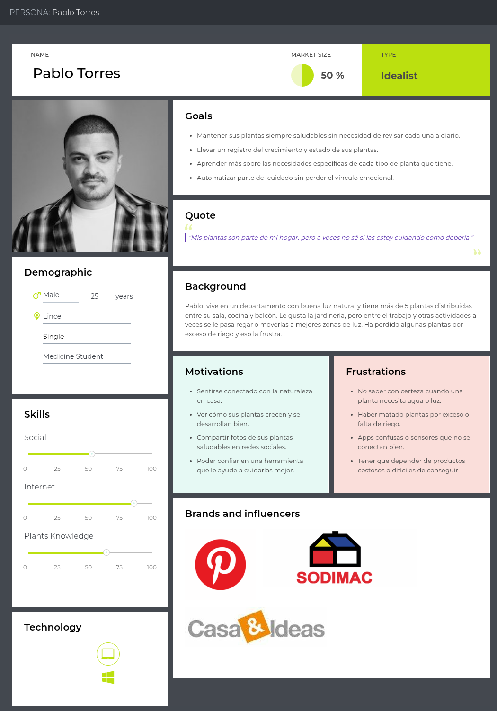

# Capítulo II: Requirements Elicitation & Analysis

La recolección y el análisis de requisitos constituyen la piedra angular de cualquier proyecto exitoso. En esta fase se identifican y documentan, de manera sistemática, las necesidades, expectativas y restricciones de todos los grupos de interés (stakeholders), así como los objetivos de negocio que el proyecto debe cumplir. Para lograrlo, se emplean técnicas como entrevistas individuales, encuestas cuantitativas, talleres colaborativos y análisis de la competencia, que permiten obtener una visión integral y detallada de lo que se desea alcanzar.

Un análisis riguroso de estos requisitos proporciona una base firme para el diseño y desarrollo posteriores, minimiza retrabajos y alineaciones erróneas, y garantiza que la solución final no solo satisfaga las necesidades reales de los usuarios, sino que también aporte valor al negocio. De este modo, se establecen criterios claros de éxito y se facilita la toma de decisiones a lo largo de todo el ciclo de vida del proyecto, optimizando recursos y tiempos.

## 2.1. Competidores

Nuestro proyecto se centra en el desarrollo de Macetech, una solución de jardinería inteligente que integra hardware y software para ofrecer a los usuarios un cuidado de plantas completamente automatizado y personalizado. Gracias a sensores IoT avanzados y a una plataforma móvil y web intuitiva, Macetech monitorea en tiempo real variables clave (humedad del sustrato, temperatura, luz, pH) y activa un sistema de riego automatizado, además de brindar alertas y recomendaciones basadas en algoritmos de IA.

Partiendo de estas capacidades innovadoras, hemos identificado y analizado a los principales competidores que podrían desafiar nuestra propuesta en el mercado de jardinería doméstica inteligente. Estas empresas representan una amenaza potencial para la adopción y crecimiento de Macetech, ya que cuentan con trayectoria en dispositivos conectados, equipos multidisciplinarios y recursos para escalar rápidamente. A continuación, presentamos los competidores más relevantes y sus puntos fuertes:

**Click & Grow Smart Garden**

Página web principal: https://uk.clickandgrow.com/?srsltid=AfmBOop4Wmi3FQCFLOLnTW9ZWkDObAN6YCZseEiBAu6hL1T1ov6BtDX1

###### Figura 2

_Modelo del producto Smart Garden ofrecido por Click & Grow_

  

Click & Grow es una compañía estoniana fundada en 2009 por Mattias Lepp y sus colegas, con sede en Tartu, Estonia. Su misión es llevar la jardinería a hogares de todo el mundo mediante sistemas de cultivo inteligentes y de bajo mantenimiento.

Desde su lanzamiento, Click & Grow ha popularizado el concepto de “jardín de interior” automatizado. Para 2023, la empresa había vendido más de 500 000 unidades en más de 70 países, consolidándose como uno de los líderes del mercado de jardinería doméstica inteligente.

Su propuesta de valor se sustenta en los siguientes componentes y funcionalidades:

- **Cartuchos de cultivo patentados (“plant pods”):** Cápsulas presembradas con semillas, sustrato y nutrientes balanceados que simplemente se insertan en la unidad y garantizan un crecimiento óptimo sin necesidad de trasplantes ni fertilizantes adicionales.

- **Sistema de riego automático por capilaridad:** Un depósito de agua integrado suministra humedad de forma constante a las raíces de las plantas mediante mechas capilares, evitando tanto el encharcamiento como la sequía.

- **Iluminación LED de espectro optimizado:** Lámparas de LED que emulan la luz solar necesaria en cada fase de crecimiento, programadas para ciclos de 16 horas de luz y 8 de oscuridad, maximizando la fotosíntesis.

- **Plataforma de gestión móvil:** Una aplicación (iOS/Android) permite supervisar el nivel de agua, la fase de crecimiento de cada planta y recibir notificaciones para rellenar el depósito o cambiar los cartuchos.

- **Variedad de kits temáticos:** Desde hierbas culinarias y flores ornamentales hasta microgreens y plantas aromáticas, con más de 60 tipos de “plant pods” disponibles.

- **Diseño modular y escalable:** Las unidades se pueden interconectar para crear jardines más grandes, adaptándose a diferentes espacios y necesidades estéticas.

- **Sostenibilidad y conveniencia:** El sistema está diseñado para minimizar el uso de agua (hasta un 90 % menos que el riego convencional) y reducir los desperdicios de nutrientes, al tiempo que facilita la experiencia a usuarios sin conocimientos previos de jardinería.

Gracias a su enfoque _plug & play_, Click & Grow atrae a consumidores que buscan combinar tecnología y naturaleza en el hogar sin dedicar tiempo a tareas de mantenimiento complejas. No obstante, su dependencia de cartuchos específicos y la falta de sensores de calidad del aire o la temperatura ambiental constituyen áreas donde soluciones como Macetech pueden diferenciarse.

**Xiaomi Mi Flower Care Plant Sensor:**

Página web de venta: https://www.amazon.es/Flower-Care-fertilidad-feuchtigkeitsgrad-temperatur/dp/B01MUDQD8I

###### Figura 3

_Modelo del producto Mi Flower Care Plant Sensor ofrecido por Xiaomi con su línea Mi Ecosystem_

  

Xiaomi Mi Flower Care es un dispositivo de la línea _Mi Ecosystem_, lanzado en 2017 por la filial Xiaomi Youpin, con sede en Beijing, China. Su objetivo es ofrecer un sensor compacto y asequible para el cuidado de plantas de interior, integrándose al ecosistema Mi Home de Xiaomi.

A la fecha, Xiaomi ha distribuido más de 1 millón de unidades mundialmente, destacándose por su excelente relación calidad-precio y fácil integración con otros dispositivos inteligentes del hogar.

Principales características y funcionalidades:

- **Sensores multiparámetro:** Mide humedad del suelo, temperatura ambiental, intensidad de luz y fertilidad del sustrato utilizando un sensor de conductividad eléctrica (EC).

- **Conectividad Bluetooth:** Se conecta vía Bluetooth BLE a la aplicación Mi Home (iOS/Android), donde se muestran gráficas históricas y alertas de cuidado.

- **Batería de larga duración:** Funciona con una pila CR2 reemplazable, con autonomía aproximada de 4 a 6 meses según uso y entorno.

- **Alertas y recomendaciones:** La app notifica cuándo regar, cuándo aportar fertilizante y si la planta sufre estrés por luz o temperatura, basándose en umbrales preconfigurados para diversas especies.

- **Compatibilidad con Mi Home:** Permite crear automatizaciones (por ejemplo, encender luces de cultivo o activar sistemas de riego conectados al ecosistema Xiaomi) y agrupar múltiples sensores en escenas inteligentes.

- **Diseño minimalista:** Carcasa plástica blanca con varilla metálica de inserción en el sustrato y un indicador LED que cambia de color ante alertas críticas.

- **Amplia base de datos de plantas:** La app incluye más de 1 000 especies registradas, con rangos de óptimos de humedad, luz y nutrientes para cada una.

Xiaomi Mi Flower Care destaca por democratizar el monitoreo ambiental en jardinería doméstica a bajo costo. Sin embargo, carece de un sistema de riego automático integrado y de conectividad Wi-Fi directa, lo que limita el control remoto sin puente BLE. Soluciones como Macetech pueden diferenciarse al combinar sensores avanzados con riego automatizado y conectividad continua a Internet sin hardware adicional.

**Masdio Ivy Smart Flowerpot:**

Página web principal: https://masdio.com/products/masdio-ivy-smart-flowerpots?srsltid=AfmBOoq5XFcFZDC3qflRMSbY0cfU3VHAFg-Ostn8YsCG320rDy-xm6KE

###### Figura 4

_Modelo del producto Ivy Smart Flowerpot ofrecido por Masdio_

  

Masdio es una startup española que en 2023 lanzó la maceta inteligente Ivy Smart Flowerpot, diseñada para cultivo de interior con enfoque en diseño minimalista y conectividad integral. Se distribuye en Europa y Latinoamérica a través de su web y partners de decoración.

Principales características y funcionalidades:

- **Diseño modular y estético:** Con acabado cerámico mate y variedad de colores, incluye soporte de madera natural para integrarse a cualquier ambiente de hogar u oficina.

- **Sensores integrados:** Mide humedad del sustrato, temperatura y luz ambiental mediante sensores de alta precisión.

- **Aviso y notificaciones de riego:** Cuando los sensores de humedad indican muy bajos niveles, la maceta le pasará una notificación a la aplicación la cual luego se le presentará al usuario para que pueda actuar ante tal riesgo con facilidad y rapidez.

- **Conectividad Wi-Fi y Bluetooth:** Se conecta a la app Masdio (iOS/Android) vía Wi-Fi 2.4 GHz; BLE actúa como fallback local si la señal fluctúa.

- **App Masdio:** Ofrece vistas en tiempo real, historial de datos, notificaciones push (riego, luz insuficiente, temperatura extrema) y consejos para más de 500 especies.

- **Integración con asistentes:** Compatible con Amazon Alexa y Google Assistant para consultas de voz como “¿Cuánta agua necesita mi planta?”

- **Fácil montaje y limpieza:** Sistema plug-and-play sin herramientas; componentes desmontables aptos para lavado manual.

Macetech puede superar a Ivy Smart Flowerpot al ofrecer depósito de mayor capacidad flexible según modelo, sensores avanzados de pH y salinidad, plataforma abierta de datos IoT (no propietaria), y algoritmos de recomendación basados en aprendizaje automático para diagnóstico de enfermedades.

### 2.1.1. Análisis competitivo

El análisis competitivo nos brinda una visión clara de cómo nos comparamos con nuestros competidores en el mercado. Nos ayuda a identificar áreas en las que podemos mejorar, así como oportunidades para diferenciarnos y destacar. Esta comprensión nos permite desarrollar estrategias más efectivas como grupo, lo que nos ayuda a alcanzar nuestros objetivos y mantenernos competitivos en el mercado.    

###### Tabla 4

_Análisis Competitivo organizado para todos los competidores potenciales de Macetech_

<table border="1" style="text-align: center;">
  <tbody>
    <tr>
      <td colspan="6"><strong>Competitive Analysis Landscape</strong></td>
    </tr>
    <tr>
      <td colspan="2"><strong>¿Por qué llevar a cabo este análisis?</strong></td>
      <td colspan="4">
        Este análisis nos ayudará a detectar las carencias y brechas de los productos actuales, para diseñar una maceta inteligente más completa, práctica y alineada con las necesidades reales de los usuarios.
      </td>
    </tr>
    <tr>
      <td colspan="2"></td>
      <td><strong>Macetech</strong></td>
      <td><strong>Click and Grow</strong> </td>
      <td><strong>Xiaomi Mi Flower Care</strong></td>
      <td><strong>Masdio Flowerpot</strong></td>
    </tr>
    <tr>
      <td rowspan="2"><strong>Perfil</strong></td>
      <td>Overview</td>
      <td>Maceta inteligente de arquitectura abierta, con sensores avanzados de humedad, pH, conductividad y luz; sistema de riego autónomo controlado por IA; y plataforma web y móvil que combina análisis de datos, reportes de salud vegetal y recomendaciones personalizadas basadas en perfil de especie y del usuario.</td>
      <td>Sistema de cultivo automatizado que emplea cápsulas de nutrientes premezclados y un depósito de agua cerrado. Gestiona automáticamente el riego, la aireación y la nutrición para una variedad de hierbas y hortalizas, garantizando condiciones óptimas sin intervención diaria.</td>
      <td>Dispositivo compacto equipado con sensores de humedad, luminosidad, temperatura y conductividad eléctrica del suelo. Transmite datos en tiempo real mediante Bluetooth a una aplicación móvil, permitiendo diagnósticos precisos y alertas en el smartphone del usuario.</td>
      <td>Maceta inteligente con diseño modular e iluminación LED integrada. Incluye sensores básicos de humedad y temperatura, y ofrece programación de escenas lumínicas para realzar el valor decorativo de las plantas en interiores.</td>
    </tr>
    <tr>
      <td>Ventaja competitiva ¿Qué valor ofrece a los clientes?</td>
      <td>Integra un sistema de riego inteligente impulsado por IOT y un conjunto de sensores multidimensionales que no solo monitorizan parámetros clave, sino que detectan problemas en la planta vía algoritmos de aprendizaje automático y sugieren acciones preventivas o correctivas específicas para cada especie.</td>
      <td>Simplifica por completo la jardinería al eliminar la necesidad de conocimiento técnico; sus cápsulas estandarizadas reducen el margen de error en la dosificación de nutrientes y su autonomía prolongada facilita la práctica a usuarios muy ocupados.</td>
      <td>Proporciona lecturas ambientales de alta precisión, permitiendo al aficionado tomar decisiones informadas y remotas sobre riego y ubicación de plantas sin instalaciones complejas.</td>
      <td>Combina tecnología y diseño interior, ofreciendo una experiencia sensorial a través de iluminación personalizable y alertas visuales sobre niveles de agua, lo que mejora tanto la estética como la usabilidad en espacios de vivienda y oficina.</td>
    </tr>
    <tr>
      <td rowspan="2"><strong>Perfil de Marketing</strong></td>
      <td>Mercado objetivo</td>
      <td>Jardineros nuevos y profesionales de paisajismo en entornos urbanos, que requieren una plataforma integral de IoT para gestionar múltiples plantas, optimizar recursos hídricos y energéticos, y recibir asesoramiento botánico personalizado en tiempo real.</td>
      <td>Hogares urbanos y familias que buscan cultivar alimentos frescos sin curva de aprendizaje, valorando la conveniencia y el diseño compacto.</td>
      <td>Aficionados a la jardinería doméstica que ya poseen plantas y desean herramientas de precisión para optimizar su cuidado mediante datos.</td>
      <td>Usuarios interesados en tecnología de estilo de vida y decoración inteligente, que buscan un complemento estético con funcionalidad básica de monitoreo.</td>
    </tr>
    <tr>
      <td>Estrategias de marketing</td>
      <td>Marketing digital dirigido a jardineros urbanos y profesionales de paisajismo, con contenido educativo en redes, webinars de “jardinería inteligente” y alianzas con viveros.</td>
      <td>Campañas en redes sociales, colaboración con influencers de jardinería y estilo de vida saludable, y venta a través de e-commerce especializado en hogar y cocina.</td>
      <td>Promoción dentro del ecosistema Xiaomi, alianzas con tiendas de electrónica y reseñas en plataformas tech, reforzadas por demostraciones en puntos de venta físicos.</td>
      <td>Enfoque en comunidades de diseño de interiores y decoración, con presencia en boutiques de lifestyle, ferias de diseño y colaboraciones con revistas especializadas.</td>
    </tr>
    <tr>
      <td rowspan="3"><strong>Perfil de Producto</strong></td>
      <td>Productos & Servicios</td>
      <td>Maceta inteligente con sensores de humedad, pH, conductividad y luz, riego automatizado ajustado al perfil de la planta, y plataforma móvil/web para visualización de datos.</td>
      <td>Maceta inteligente con cápsulas de nutrientes premezclados y sistema cerrado de riego automático.</td>
      <td>Sensor portátil que mide humedad, luz, temperatura y conductividad, con app de recomendaciones personalizadas.</td>
      <td>Maceta decorativa con sensores básicos de humedad e iluminación LED ambiental.</td>
    </tr>
    <tr>
      <td>Precios & Costos</td>
      <td>Precio alto, cubre hardware completo y garantiza un margen bruto ≥35 %; sin consumibles obligatorios.</td>
      <td>Precio medio-alto, con modelo de negocio basado en venta recurrente de cápsulas de cultivo.</td>
      <td>Bajo costo inicial, sin suscripciones ni consumibles, solo mantenimiento de baterías.</td>
      <td>Precio accesible, orientado a la decoración; costos reducidos en sensores básicos y carcasas.</td>
    </tr>
    <tr>
      <td>Canales de distribución (Web y/o Móvil)</td>
      <td>Venta directa en nuestro e-commerce, canales B2B (viveros y paisajistas) y plataformas de jardinería urbana.</td>
      <td>App móvil de control, tienda online oficial y marketplaces como Amazon.</td>
      <td>Integración con app Mi Home, venta en tiendas Xiaomi, grandes retailers y marketplaces.</td>
      <td>Comercio electrónico en tiendas de decoración y gadgets, con presencia en e-commerce de nicho.</td>
    </tr>
    <tr>
      <td rowspan="4"><strong>Análisis SWOT</strong></td>
      <td>Fortalezas</td>
      <td>
        <ul>
          <li>Monitoreo integral (humedad, pH, conductividad, luz) y riego totalmente automatizado.</li>
          <li>Plataforma web/móvil con visualizaciones detalladas y recomendaciones personalizadas.</li>
        </ul>
      </td>
      <td>
        <ul>
          <li>Cultivo “plug & play” con cápsulas premezcladas y sistema cerrado de riego.</li>
          <li>Diseño minimalista y fácil de usar en interiores.</li>
        </ul>
      </td>
      <td>
        <ul>
          <li>Datos precisos en tiempo real sobre múltiples parámetros (humedad, luz, temperatura).</li>
          <li>App con base de datos de especies y sugerencias.</li>
        </ul>
      </td>
      <td>
        <ul>
          <li>Estética moderna con iluminación LED ambiental.</li>
          <li>Instalación inmediata y bajo mantenimiento.</li>
        </ul>
      </td>
    </tr>
    <tr>
      <td>Debilidades</td>
            <td>
        <ul>
          <li>Precio alto que puede limitar adopción.</li>
          <li>Dependencia de conectividad estable y calibración periódica de sensores.</li>
        </ul>
      </td>
      <td>
        <ul>
          <li>Sistema propietario de cápsulas genera costos recurrentes.</li>
          <li>Personalización limitada a las plantas compatibles.</li>
        </ul>
      </td>
      <td>
        <ul>
          <li>Alcance limitado a Bluetooth, sin control remoto ni riego automático.</li>
          <li>Sin consumibles, pero sin funciones de acción sobre la planta.</li>
        </ul>
      </td>
      <td>
        <ul>
          <li>Funcionalidad de monitoreo muy básica.</li>
          <li>Ausencia de automatización real; utilidad mayormente decorativa.</li>
        </ul>
      </td>
    </tr>
    <tr>
      <td>Oportunidades</td>
            <td>
        <ul>
          <li>Posibilidad de ampliar la línea con módulos adicionales (fertilizantes, sensores de CO₂).</li>
          <li>Integración con asistentes de voz y ecosistemas smart home.</li>
        </ul>
      </td>
      <td>
        <ul>
          <li>Expansión a más especies y tipos de cápsulas.</li>
          <li>Conexión con apps de terceros y plataformas de e-commerce.</li>
        </ul>
      </td>
      <td>
        <ul>
          <li>Evolución a Wi-Fi o NB-IoT para supervisión remota.</li>
          <li>Integración con ecosistemas inteligentes (Alexa, Google Home)..</li>
        </ul>
      </td>
      <td>
        <ul>
          <li>Incorporación de sensores adicionales y mini-riegos automáticos.</li>
          <li>Colaboraciones con marcas de interiorismo.</li>
        </ul>
      </td>
    </tr>
    <tr>
      <td>Amenazas</td>
            <td>
        <ul>
          <li>Competencia de soluciones más económicas o DIY.</li>
          <li>Fallos en hardware o calibración pueden erosionar la confianza del usuario.</li>
        </ul>
      </td>
      <td>
        <ul>
          <li>Costos de mantenimiento elevados por cápsulas.</li>
          <li>Presión de competidores con modelos abiertos y kits genéricos.</li>
        </ul>
      </td>
      <td>
        <ul>
          <li>Rápida obsolescencia si no añade funciones de acción remota.</li>
          <li>Competencia de sensores individuales con más conectividad.</li>
        </ul>
      </td>
      <td>
        <ul>
          <li>Percepción de producto meramente estético.</li>
          <li>Dificultad para justificar precio frente a macetas decorativas sin tecnología real.</li>
        </ul>
      </td>
    </tr>
  </tbody>
</table>

- ### 2.1.2. Estrategias y tácticas frente a competidores

  Para destacar frente a competidores y consolidar nuestra posición en el mercado de jardinería inteligente, resulta imprescindible diseñar e implementar un conjunto de estrategias y tácticas coordinadas que refuercen nuestra diferenciación y capten la atención de los segmentos objetivo. A continuación, se presentan las principales líneas de acción:

- **Desarrollo de una Propuesta de Valor Distintiva**

  **Estrategia:** Precisar y articular el beneficio central de Macetech: la provisión de un sistema de cuidado de plantas verdaderamente autónomo, basado en monitoreo continuo de variables críticas (humedad, temperatura, pH, conductividad y luz) y en el envío de alertas contextuales.

  **Táctica:** Conducir estudios cualitativos y cuantitativos —entrevistas estructuradas, encuestas y focus groups— con usuarios residenciales de diversos perfiles (urbanos con balcones, oficinas, universidades) para mapear sus principales frustraciones y expectativas. A partir de los hallazgos, enfatizar en nuestros materiales de comunicación características como el disparo automático de riego al superar umbrales críticos de humedad y las recomendaciones inteligentes de iluminación.

- **Optimización de la Experiencia de Usuario (UX)**

  **Estrategia:** Garantizar una curva de aprendizaje mínima, así como una interacción fluida desde la instalación inicial del dispositivo hasta la consulta diaria de datos, alineada con los principios de diseño centrado en el usuario y el minimalismo funcional.

  **Táctica:** Desarrollar prototipos de la interfaz móvil y web empleando metodologías Agile y Design Thinking; realizar múltiples rondas de pruebas de usabilidad con usuarios sin experiencia en tecnologías IoT, evaluando métricas de éxito como tasa de completitud de tareas, tiempos de respuesta y grado de autonomía al configurar la maceta.

- **Expansión de la Base de Usuarios**

  **Estrategia:** Ampliar el alcance de Macetech a subsegmentos específicos (entusiastas de plantas ornamentales, propietarios de huertos caseros, profesionales de oficina) mediante propuestas de valor adaptadas a sus necesidades y motivaciones particulares.

  **Táctica:** Diseñar promociones de lanzamiento (por ejemplo, bundles con fertilizantes inteligentes o descuentos para compras múltiples), además de habilitar una versión freemium de la aplicación que permita a los usuarios explorar la plataforma de monitoreo sin compromiso de compra inmediata de hardware.

- **Marketing Digital de Alta Precisión**

  **Estrategia:** Implementar campañas de performance marketing segmentadas por comportamientos e intereses afines (seguidores de cuentas de jardinería urbana, smart home, sostenibilidad) aprovechando plataformas de Social Ads y Search Ads.

  **Táctica:** Crear contenidos en video de formato corto (Reels, TikToks) que demuestren casos de uso reales —por ejemplo, la recuperación de una planta marchita gracias al riego programado—, segmentando audiencias mediante lookalike audiences y retargeting dinámico basado en la interacción con landing pages especializadas.

- **Alianzas Comerciales y Cooperaciones Estratégicas**

  **Estrategia:** Forjar sinergias con viveros, cadenas de tiendas de jardinería, estudios de paisajismo y marcas de decoración para ampliar canales de distribución y credibilidad del producto.

  **Táctica:** Desarrollar acuerdos de co-branding para incluir Macetech en kits de plantación (“kit inteligente + planta”), organizar workshops conjuntos con influencers y expertos en horticultura, y participar en ferias de sostenibilidad y eventos de tecnología aplicada al hogar, garantizando exhibiciones interactivas y demostraciones en vivo.

## 2.2. Entrevistas

El propósito de las entrevistas personales en Macetech consiste en profundizar en las experiencias y motivaciones de nuestros usuarios clave para fundamentar el diseño y la optimización de la plataforma y dispositivo de jardinería inteligente. Mediante una guía semiestructurada, buscamos identificar patrones de uso y _pain points_ específicos, de modo que los módulos de monitoreo, riego automático y seguimiento de progreso de cuidado se ajusten de forma precisa a las necesidades reales (Hair Jr. et al., 2023).

Al centrar las conversaciones en la interacción entre el usuario con sus plantas, el uso de tecnología en el cuidado y los conocimientos sobre riego y nutrientes, obtenemos información cualitativa y cuantitativa. Esto nos permite validar y refinar nuestras hipótesis de diseño.

Estas entrevistas generan una base de conocimiento que orienta el desarrollo continuo de Macetech, asegurando que cada nueva funcionalidad responda directamente a los requerimientos y expectativas de nuestros usuarios.

- ### 2.2.1. Diseño de entrevistas

  En esta sección se presenta el diseño de las entrevistas, estructurado en tres fases. En la primera fase se recopilan datos demográficos y contextuales del participante con 5 preguntas; a continuación, las preguntas se organizan según el segmento objetivo al que pertenezca. Cada segmento incluye 15 preguntas específicas, lo que resulta en un total de 20 ítems por entrevista. Cabe señalar que, si el entrevistado profundiza en sus respuestas y aborda de forma espontánea cuestiones aún no planteadas, el entrevistador podrá omitir dichas preguntas y avanzar directamente a los siguientes ítems.

* **Información general del participante**

  1. Nombre:
  2. Edad:
  3. Ubicación actual con provincia y distrito:
  4. Ocupación:
  5. Nivel de experiencia con plantas: [Principante, Intermedio, Avanzado]

* **Segmento 1: Personas apasionadas por las plantas**

  **Objetivo**: Explorar las motivaciones, hábitos, retos, y percepción de la tecnología de personas con un vínculo emocional fuerte con las plantas, ya sea en el hogar o en pequeños jardines.

  - Preguntas de exploración inicial (contexto general)

    1. ¿Podrías contarme cómo empezó tu interés por el cuidado de plantas?

    2. ¿Cuántas plantas cuidas actualmente y qué tipo de plantas prefieres (interior, exterior, comestibles, decorativas, etc.)?

    3. ¿Con qué frecuencia sueles dedicar tiempo al cuidado de tus plantas? ¿Tienes alguna rutina específica?

  - Preguntas de seguimiento y profundización ante la exploración inicial (Probes):

    4. ¿Qué haces exactamente durante ese tiempo?

    5. ¿Hay momentos del día o del año donde cuidas más de ellas?

  - Desafíos actuales y soluciones empleadas

    6. ¿Cuáles dirías que son los principales retos que enfrentas al cuidar tus plantas?

    7. ¿Has utilizado alguna herramienta, app o dispositivo tecnológico para ayudarte con el riego o monitoreo? ¿Cuál fue tu experiencia?

  - Actitud frente a la tecnología (antes de presentar el producto)

    8. ¿Qué te parecería contar con una maceta que pueda regar automáticamente tus plantas y monitorear su salud?

    9. ¿Qué beneficios imaginas que te podría ofrecer una maceta inteligente? ¿Y qué dudas o preocupaciones te generaría?

  - Reacción tras presentar el concepto de Macetech

    **Objetivo**: Validar aceptación, percepción de valor, integración en el estilo de vida, y disposición de pago.

    10. Después de conocer lo que hace nuestra maceta inteligente, ¿qué función te parece más útil o valiosa? ¿Por qué?

    11. ¿Considerarías esta maceta como una inversión en el cuidado de tus plantas o como un lujo? ¿Qué resultados esperas ver para sentir que fue una buena inversión?

  - Preguntas de seguimiento y profundización ante la presentación del concepto de Macetech (Probes):

    12. En una escala del 1 al 5, ¿qué tan dispuesto/a estarías a usar este tipo de tecnología con tus plantas? (1 = Nada dispuesto, 5 = Muy dispuesto)

    13. ¿Cómo imaginas que este dispositivo encajaría en tu hogar? ¿El diseño y tamaño serían importantes para ti?

    14. ¿Qué tan útil te parecería tener una app móvil o web para recibir notificaciones, ver métricas o controlar el riego?

    15. ¿Qué otras funciones o características te gustaría que tuviera Macetech para mejorar tu experiencia?

* **Segmento 2:** Personas dedicadas a la jardinería (profesional o semiprofesional)

  **Objetivo:** Identificar prácticas comunes, herramientas utilizadas, puntos de dolor críticos y percepción de valor funcional de una solución como Macetech en contextos más técnicos o comerciales.

  - Preguntas de contexto y rutina profesional

    1. ¿Cuántos años de experiencia tienes en jardinería? ¿Trabajas de forma independiente, en viveros, o en proyectos particulares?

    2. ¿Qué tipo de plantas manejas con más frecuencia? ¿Cuál es el volumen promedio de plantas que cuidas?

    3. ¿Podrías describirme cómo es tu proceso habitual de riego, fertilización y monitoreo?

  - Problemas y recursos actuales

    4. ¿Qué dificultades enfrentas hoy en el manejo de plantas (riego, clima, plagas, tiempo, recursos, etc.)?

    5. ¿Utilizas actualmente alguna tecnología para ayudarte con estas tareas? ¿Qué tan útil ha sido?

  - Preguntas de seguimiento y profundización ante las preguntas de contexto y rutina profesional (Probes):

    6. ¿Qué te funciona bien hoy?

    7. ¿Qué te gustaría que funcione mejor?

  - Expectativas y percepción frente a soluciones inteligentes

    8. Si tuvieras un sistema automatizado que controle riego, humedad y nutrientes, ¿cuál de estas variables te sería más crítica monitorear?

    9. ¿Qué tan importante sería para ti poder visualizar toda esta información desde una plataforma web o móvil?

    10. ¿Preferirías un sistema que simplemente automatice tareas o uno que te brinde recomendaciones y control manual?

  - Reacción ante Macetech

    11. Luego de conocer nuestra maceta inteligente, ¿qué opinas sobre su utilidad práctica en tu trabajo diario?

    12. ¿Qué características crees que deben mejorarse o incluirse para ser realmente útil a nivel profesional?

    13. En una escala del 1 al 5, ¿qué tan probable es que consideres adoptar este tipo de tecnología como parte de tus herramientas de jardinería?

    14. ¿Qué elementos influirían más en tu decisión de compra (precio, ahorro de agua, menor carga de trabajo, confiabilidad)?

    15. ¿Cuánto estarías dispuesto a pagar por una unidad como esta, considerando su funcionalidad y durabilidad?

- ### 2.2.2. Registro de entrevistas

  El registro sistemático de las entrevistas constituye una herramienta esencial para la recopilación y organización rigurosa de la información obtenida de nuestros usuarios. Al documentar de manera estructurada las respuestas, comentarios y observaciones relevantes, se facilita el análisis cualitativo y la detección de patrones o tendencias que sustentan la toma de decisiones (Hair Jr. et al., 2023). Asimismo, contar con un historial detallado de las interacciones permite asegurar la coherencia en el seguimiento de las necesidades y expectativas del usuario a lo largo de las distintas fases del proyecto.

  Para acceder a la grabación completa de las entrevistas realizadas, puede consultarse el siguiente enlace al recurso:

  [Entrevistas de Usuario para el Proyecto Macetech – Equipo de SevenSync](https://upcedupe-my.sharepoint.com/:v:/g/personal/u202218996_upc_edu_pe/EcVM5lwBSMdCiN10VPn4zG4BnJzx430mr3skPPjFyVnn6Q?nav=eyJyZWZlcnJhbEluZm8iOnsicmVmZXJyYWxBcHAiOiJTdHJlYW1XZWJBcHAiLCJyZWZlcnJhbFZpZXciOiJTaGFyZURpYWxvZy1MaW5rIiwicmVmZXJyYWxBcHBQbGF0Zm9ybSI6IldlYiIsInJlZmVycmFsTW9kZSI6InZpZXcifX0%3D&e=VnGTI5)

---

A continuación se presenta la documentación detallada de cada entrevista realizada, complementaria al vídeo previamente mencionado. Para cada caso, se incluyen los datos principales del participante, el minuto exacto de aparición en la grabación y un resumen conciso de los puntos más relevantes tratados.

**Segmento 1 - Jardineros Nuevos e Inexpertos:**

- **Entrevista N°1**

  - **Nombre y apellidos:** Rosalinda Quispe
  - **Edad:** 43 años
  - **Departamento:** Lima
  - **Distrito:** Villa María del Triunfo
  - **Ocupación:** Carpintera
      
  - **Tiempo de Entrevista:** 8 minutos con 35 segundos
  - **Inicio de Entrevista:** 0:00
  - **Final de Entrevista:** 8:35
      

    ###### Figura 5

    _Captura de pantalla de la primera entrevista realizada al primer segmento objetivo de Macetech_

      

    _Nota_. En la imagen se puede visualizar a la entrevistada, Rosalinda Quispe, en el lado derecho, mientras que el entrevistador y miembro de SevenSync, Ruben Mallma, se encuentra en el lado izquierdo.

  - **Resumen De Entrevista**

    La entrevistada, sin experiencia formal en jardinería ni ocupación directa relacionada con plantas, manifestó un vínculo emocional profundo con sus macetas, especialmente aquellas con valor decorativo o productivo. Su interés en el cuidado de plantas comenzó hace 19 años, como una forma de relajación y conexión personal, lo que la ha llevado a establecer una rutina diaria de observación y cuidado sin ningún tipo de especialización técnica. Su nivel de experiencia es empírico, basado en observación constante y métodos caseros como el uso de ajo diluido en agua para tratar enfermedades.

    Cuida diversas plantas, con preferencia por aquellas que producen frutos, aunque actualmente cultiva mayormente especies decorativas por su simplicidad. Identifica como principales retos la aparición de plagas y enfermedades, lo cual le genera preocupación y tristeza cuando no puede resolverlo. No utiliza herramientas digitales ni dispositivos tecnológicos, sino remedios caseros, y confía en su intuición para interpretar el estado de sus plantas.

    La propuesta de Macetech le resulta “tranquilizante” y atractiva. Imagina la maceta inteligente como una solución útil que le permitiría conocer el estado de sus plantas (humedad, nutrientes, pH) y actuar en consecuencia sin depender únicamente de su experiencia empírica. Considera que esta tecnología sería un lujo, pero también una inversión justificada, especialmente si le permite cultivar plantas con frutos de manera más eficiente. Preferiría revisar los datos en una laptop del hogar, sin necesidad de integrar el sistema a su rutina laboral o móvil. Le parece ideal tener una interfaz integrada en la casa que le permita ver el estado de todas sus plantas sin esfuerzo adicional.

    **Características objetivas:**

    - Tecnología actual:

      No emplea dispositivos tecnológicos; usa métodos caseros (ajo diluido) para tratar plagas.

    - Dispositivos:

      Prefiere usar laptop doméstica; no requiere conexión con smartphone.

    - Canales de interacción deseados:

      Dashboard web doméstico. No necesita acceso móvil frecuente. Que muestre la salud general de la planta, humedad del suelo, nutrientes, signos de enfermedad o estrés vegetal.

      Guía digital incorporada (explicaciones contextualizadas de alertas, p. ej., cómo corregir pH).

    - Expectativas tecnológicas:

      Interfaz sencilla en laptop; monitoreo pasivo diario; automatización útil, pero no prioriza conectividad móvil ni funciones complejas.

    **Características subjetivas:**

    - Motivaciones:

      Cuidado emocional y afectivo hacia las plantas; satisfacción personal por verlas crecer y florecer.

    - Diseño y estética:

      No especificado, pero acepta un volumen mayor en la maceta si eso implica mayor funcionalidad.

    - Percepción de valor:

      Considera que la maceta es una mezcla de lujo e inversión; más inclinada a valorarla por su impacto emocional que por su rentabilidad.

    - Influencia de marcas:

      Se enfoca en el bienestar de sus plantas más que en la marca del producto.

    - Personalidad:

      Cuidadora emocional; conectada espiritualmente con sus plantas; busca simplicidad, apoyo tecnológico sin dependencia digital y soluciones accesibles.

---

 

- **Entrevista N°2**

  - **Nombre y apellidos:** Sirley Zapata
  - **Edad:** 54 años
  - **Departamento:** Cajamarca
  - **Distrito:** Cajamarca
  - **Ocupación:** Ama de casa
      
  - **Tiempo de Entrevista:** 6 minutos con 22 segundos
  - **Inicio de Entrevista:** 8:36
  - **Final de Entrevista:** 14:57
      

    ###### Figura 6

    _Captura de pantalla de la segunda entrevista realizada al primer segmento objetivo de Macetech_

      

    _Nota_. En la imagen se puede visualizar a la entrevistada, Sirley Zapata, en el centro de la pantalla, mientras que el entrevistador y miembro de SevenSync, Luiggi Paredes, se encuentra en el lado superior derecho.

  - **Resumen De Entrevista**

    La entrevistada es una aficionada de larga data al cuidado de plantas ornamentales, actividad que practica desde su infancia, pero no desde un punto profesional, sino más como una aficionada. Se muestra apasionada por el aspecto estético (“disfruto de que una planta se haga bonita a la vista”) y al mismo tiempo preocupada por desafíos prácticos, especialmente el control de plagas y el riego (“a veces olvido regarla o la riego demasiado y se pueden pudrir o ahogar”).

    Actualmente no utiliza ningún dispositivo tecnológico para el riego o supervisión, pero valora positivamente la idea de una maceta inteligente que automatice estas tareas. Espera que el sistema le avise precisamente cuándo y cuánta agua necesita cada planta, así como recomendaciones de abonado adecuadas a cada especie. En cuanto al diseño, desea que la maceta combine con la decoración de su hogar, tal como una pieza de cerámica moderna, y que los cables, en caso de haberlos, queden discretos (“no quisiera que tenga un aspecto desagradable”).

    Respecto al uso de una aplicación móvil o web, la participante solicita una interfaz muy sencilla, con recordatorios automáticos al teléfono (“alertas que me indiquen ‘tu planta necesita agua’ o que mueva la maceta a la sombra”). Sugiere además retroalimentación por voz o sonido para no depender únicamente de la app, y la inclusión de una guía digital que explique, por ejemplo, cómo corregir un pH bajo sin recurrir a múltiples recursos externos.

    **Características objetivas:**

    - Tecnología actual: No utiliza ninguna tecnología avanzada o métodos caseros para el cuidado.

    - Dispositivos:

      Smartphone (sin preferencia de sistema operativo), accediendo a través de un navegador estándar.

    - Canales de interacción deseados:

      Aplicación móvil con notificaciones push (“avísame cuándo regar” o “mueve la maceta a la sombra”).

      Guía digital incorporada (explicaciones contextualizadas de alertas, p. ej., cómo corregir pH).

      Retroalimentación por voz o sonido para no depender exclusivamente de la app.

    - Expectativas tecnológicas:

      Interfaz intuitiva, mínima curva de aprendizaje para adultos de todas las edades, y alertas claras tanto visuales como auditivas.

    **Características subjetivas:**

    - Motivaciones:

      Disfruta de ver sus plantas “bonitas a la vista” y busca tranquilidad frente a plagas y errores de riego (“pueden pudrirse o ahogarse”).

    - Diseño y estética:

      Prefiere que la maceta tenga un estilo cerámico moderno, sin cables visibles que desentonen con su sala, balcón o hall.

    - Percepción de valor:

      Considera la maceta inteligente una inversión a largo plazo si el precio es razonable, aunque teme que un costo elevado la convierta en un lujo.

    - Influencia de marcas:

      No menciona marcas específicas, pero su criterio se basa en la simplicidad y durabilidad.

    - Personalidad:

      Se percibe una personalidad pragmática y detallista, enfocada en soluciones que faciliten el mantenimiento sin sacrificar lo estético. Prefiere dispositivos móviles y navegadores web sencillos, sin plataformas avanzadas, siempre que sean intuitivos para cualquier edad.

---

 

- **Entrevista N°3**

  - **Nombre y apellidos:** Andrés Torres
  - **Edad:** 21 años
  - **Departamento:** Lima
  - **Distrito:** Lince
  - **Ocupación:** Estudiante universitario
      
  - **Tiempo de entrevista:** 8 minutos con 28 segundos
  - **Inicio de entrevista:** 14:58
  - **Fin de entrevista:** 23:26

    ###### Figura 7

    _Captura de pantalla de la tercera entrevista realizada al primer segmento objetivo de Macetech_

      

    _Nota_. En la imagen se puede visualizar al entrevistado, Andrés Torres, en casi toda la pantalla, mientras que el entrevistador y miembro de SevenSync, Fabrizio Sanchez, se encuentra en la esquina inferior derecha.

    **Resumen De Entrevista**  

    El entrevistado es un apasionado del cuidado de plantas desde que tenía 10 años, con más de una década de práctica no profesional pero aficionada. Se inclina por especies ornamentales y tropicales, como orquídeas (catleyas), palmeras y orejas de elefantes, y encuentra en la jardinería un vínculo emocional con la naturaleza, apreciando su belleza y la sensación de energía que transmiten los seres vivos. Al mismo tiempo, reconoce como principal desafío la diversidad de requerimientos de riego y cuidado: cada planta exige una dosificación exacta de agua y nutrientes, y un manejo inadecuado puede “machucarlas” y comprometer su crecimiento.

    Aunque actualmente no emplea dispositivos automatizados, ha explorado aplicaciones de identificación de plantas mediante fotografía, pero sin herramientas que asistan el riego o la supervisión de condiciones. Valora la idea de una maceta inteligente capaz de medir humedad, luz y temperatura, y que ofrezca control centralizado al momento de la siembra. Espera que el sistema le indique cuándo mover la planta de lugar o ajustar el riego, y que canalice esos datos a través de una aplicación móvil y web sencilla de operar, con notificaciones remotas al teléfono (“poder gestionarlo desde cualquier sitio”).

    En cuanto a integración en el hogar, visualiza la maceta inteligente como un componente más de una “casa moderna e inteligente”, capaz de sincronizarse con otros dispositivos de domótica (por ejemplo, Alexa) y de encajar en un entorno minimalista. Para mejorar la experiencia, recomienda que el diseño sea discreto y elegante, sin sobresalir en la decoración; que los cables queden ocultos; y que, además de alertas visuales, incorpore recordatorios sonoros o por voz. Considera la inversión rentable a largo plazo para quien cultiva varias plantas, aunque advierte que un precio elevado podría convertirla en un artículo de lujo.

    **Características objetivas:**

    - Tecnología actual:

      Ninguna (solo apps de identificación visual).

    - Dispositivos:

      Smartphone con navegador estándar; acceso deseado a aplicación móvil y web.

    - Canales de interacción:

      Notificaciones push al celular (“alerta de riego” o “mover planta”).

      Plataforma web para supervisión remota.

      Integración con asistentes de hogar inteligente (por ejemplo, Alexa).

    - Expectativas tecnológicas:

      Interfaz intuitiva, baja curva de aprendizaje, accesible para distintos perfiles de edad.

    **Características subjetivas:**

    - Motivaciones:

      Conexión emocional con la naturaleza; disfrute estético y sensorial.

    - Diseño y estética:

      Preferencia por minimalismo, ocultar cables y coherencia con decoración moderna.

    - Percepción de valor:

      Considera un gasto justificado como inversión a largo plazo, aunque precio excesivo implica sensación de lujo.

    - Influencia de marcas:

      No menciona marcas específicas; valor en la simplicidad y eficacia.

    - Personalidad:

      Emprendedor experimental, orientado a soluciones prácticas, con mentalidad de integrar domótica y automatización en su vida diaria.

---

 

**Segmento 2 - Especialistas de Jardinería y Áreas Verdes:**

- **Entrevista N°4**

  - **Nombre y apellidos:** Yasser Renteria
  - **Edad:** 25 años
  - **Departamento:** Lima
  - **Distrito:** Chorrillos
  - **Ocupación¨:** Jardinero independiente
      
  - **Tiempo de entrevista:** 8 minutos exactos
  - **Inicio de entrevista:** 23:27
  - **Fin de entrevista:** 31:27

    ###### Figura 8

    _Captura de pantalla de la primera entrevista realizada al segundo segmento objetivo de Macetech_

      

    _Nota_. En la imagen se puede visualizar al entrevistado, Yasser Rentería, en el lado derecho, mientras que el entrevistador y miembro de SevenSync, Lucio Yen, se encuentra en el lado izquierdo.

    **Resumen De Entrevista**  

    El entrevistado, Yasser Rentería Palacios, acumula cinco años de experiencia como jardinero independiente, gestionando entre 200 y 250 plantas ornamentales y aromáticas. Su nivel de expertise lo considera medio‑alto, basada en inspecciones diarias de riego (dos‑a‑tres veces por semana, ajustadas según clima) y fertilización orgánica quincenal. Identifica como principales retos las variaciones de temperatura y la aparición de nuevas plagas, las cuales actualmente detecta “a puro ojo” tras una observación constante.

    Aunque ya emplea un sistema de riego por goteo y algunas herramientas de identificación de plagas, reconoce su carácter “básico y primitivo” y valora la propuesta de Macetech para automatizar riego, humedad y nutrientes. Espera un sistema capaz de monitorizar en tiempo real la salud del suelo y la planta, y de emitir alertas precisas cuando las condiciones requieran intervención. Reclama, además, recomendaciones de acción (“saber qué debo hacer en cada momento”) y la posibilidad de visualizar toda la información desde una plataforma web o móvil, lo que califica de “muy importante” para sus proyectos tanto en interiores como en exteriores.

    Visualiza la maceta inteligente como un complemento natural en su flujo de trabajo, integrándose con otros sistemas de domótica y alineándose con un entorno minimalista. Para su uso profesional, enfatiza la necesidad de confiabilidad, eficiencia en el ahorro de agua y durabilidad del dispositivo. Considera que la automatización híbrida—combinar control automático con supervisión manual—ofrece el equilibrio ideal entre su experiencia práctica y la innovación tecnológica.

    **Características objetivas:**

    - Tecnología actual:

      Riego por goteo; identificador de plagas básico.

    - Dispositivos:

      Smartphone con navegador estándar; acceso deseado a aplicación web y móvil.

    - Canales de interacción:

      Dashboard web para supervisión remota.

      Notificaciones push al celular con alertas de riego o estado de la planta.

    - Variables críticas a monitorizar:

      Humedad y salud del suelo.

      Estado vegetal y uso eficiente del agua.

    - Expectativas tecnológicas:

      Plataforma híbrida que combine automatización continua con capacidad de control manual puntual.

    **Características subjetivas:**

    - Motivaciones:

      Mantener la salud y estética de grandes volúmenes de plantas con mínima intervención manual.

    - Diseño y estética:

      Discreto y funcional, compatible con entornos profesionales y residenciales minimalistas.

    - Percepción de valor:

      Inversión justificada si el precio y la durabilidad aseguran ahorro de tiempo y recursos; confiere prioridad a la confiabilidad.

    - Influencia de marcas:

      Ninguna en particular; valora soluciones probadas y robustas.

    - Personalidad:

      Profesional metódico y observador, orientado a la eficiencia operativa y a la incorporación gradual de innovaciones en su práctica diaria.

---

 

- **Entrevista N°5**

  - **Nombre y apellidos:** Javier Hernández
  - **Edad:** 27 años
  - **Departamento:** Lima
  - **Distrito:** Lince
  - **Ocupación:** Jardinero independiente
      
  - **Tiempo de Entrevista:** 10 minutos con 55 segundos
  - **Inicio de Entrevista:** 31:28
  - **Final de Entrevista:** 42:23

    ###### Figura 9

    _Captura de pantalla de la segunda entrevista realizada al segundo segmento objetivo de Macetech_

      

    _Nota_. En la imagen se puede visualizar al entrevistado, Javier Hernández, en el centro de la pantalla, mientras que el entrevistador y miembro de SevenSync, Juan Pescorán, se encuentra en el lado inferior derecho.

    **Resumen De Entrevista**

    Juan ejerce como jardinero profesional independiente desde los 22 años, colaborando además en proyectos de paisajismo para clientes residenciales y corporativos. Gestiona alrededor de 150–200 plantas, principalmente ornamentales, suculentas y jardines verticales. Su rutina de cuidado combina riego manual con sistemas de goteo en espacios amplios, fertilización programada mensualmente según cada especie y monitoreo visual del follaje, complementado en ocasiones con medidores básicos de humedad. Identifica como principales dificultades la imposibilidad de supervisar presencialmente todas las áreas de cultivo, las variaciones climáticas y la detección tardía de plagas, lo cual puede comprometer la salud vegetal.

    Actualmente usa sensores de humedad de precisión limitada y recordatorios manuales para riego y abonado, y valora la organización que esta técnica le aporta. Sin embargo, siente que estos recursos “funcionan, pero de forma lenta y poco fiable”. Por ello, considera que Macetech, con su capacidad para medir en tiempo real variables críticas como humedad del suelo, pH y luminosidad, y enviar reportes inmediatos al celular, aportaría una ventaja competitiva: “sería increíble no tener que estar siempre allí y solo recibir alertas automáticas”.

    En su percepción, la maceta inteligente debe ofrecer un sistema híbrido que automatice riego, monitoreo y fertilización, pero conserve la posibilidad de intervención manual. Destaca que la humedad del suelo y el nivel de nutrientes son las variables más críticas a vigilar. Asimismo, valora una plataforma web o móvil confiable, con alertas en tiempo real que no fallen ni retrasen la información. Cree que esta herramienta no solo optimizaría su eficiencia operativa, sino que reforzaría su propuesta de servicio frente a la competencia.

    **Características objetivas:**

    - Tecnología actual:

      Sistemas de riego por goteo; medidores de humedad básicos; recordatorios manuales.

    - Dispositivos:

      Prefiere usar smartphone con navegador estándar; no utiliza equipos como laptops o computadoras al no considerarlas lo suficientemente portátiles para un ambiente de jardinería.

    - Canales de interacción deseados:

      Reportes que informen sobre la humedad del suelo; nivel de nutrientes; pH; luminosidad.

      Recordatorios push; posible dashboard web para supervisión remota.

    - Expectativas tecnológicas:

      Interfaz intuitiva; alertas confiables en tiempo real; equilibrio entre automatización y control manual.

    **Características subjetivas:**

    - Motivaciones:

      Deseo de garantizar la salud y estética de grandes espacios verdes sin dependencia total de la presencia física.

    - Diseño y estética:

      Prefiere soluciones discretas que se integren con jardines residenciales y corporativos.

    - Percepción de valor:

      Considera la tecnología una inversión que elevaría su oferta de servicio, con una probabilidad de adopción de 4/5 si el precio y la usabilidad son adecuados.

    - Influencia de marcas:

      No alude a marcas específicas; prioriza la fiabilidad y durabilidad.

    - Personalidad:

      Profesional metódico, orientado a la eficiencia y a incorporar innovaciones que le permitan delegar tareas rutinarias sin sacrificar la calidad de su trabajo.

---

 

- **Entrevista N°6**

  - **Nombre y apellidos:** Betty Chumacero
  - **Edad:** 62 años
  - **Departamento:** Lima
  - **Distrito:** San Juan de Miraflores
  - **Ocupación:** Ama de casa
      
  - **Tiempo de Entrevista:** 15 minutos con 6 segundos
  - **Inicio de Entrevista:** 42:24
  - **Final de Entrevista:** 57:30

    ###### Figura 10

    _Captura de pantalla de la tercera entrevista realizada al segundo segmento objetivo de Macetech_

      

    _Nota_. En la imagen se puede visualizar a la entrevistada, Betty Chumacero, en el centro de la pantalla, mientras que el entrevistador y miembro de SevenSync, Flavio Trigueros, no aparece en la captura debido a que se encuentra en una pantalla separada de Zoom. El entrevistador sí aparece en el vídeo, pero en ningún momento el entrevistador y la entrevistada salen al mismo tiempo.

    **Resumen De Entrevista**

    Betty Chumacero, jardinera que antes trabajaba de forma profesional, pero ahora utiliza la jardinería más como un hobby, cultiva plantas desde hace aproximadamente cinco años como pasatiempo y más de 20 años como profesional. Su interés nació al experimentar la satisfacción de “darles vida” y observa diariamente sus macetas, aplicando métodos caseros de abono (cáscaras de huevo molidas) y hablando con ellas para promover su crecimiento. Aunque disfruta del proceso manual de regar, nutrir y conversar con las plantas, reconoce que, pese a sus cuidados, muchas se marchitan repentinamente, atribuible a su falta de control preciso sobre factores como la plaga de gusanos o la dosificación de agua.

    Prefiere cultivar plantas frutales y decorativas; ha experimentado con hortensias, enredaderas y, más recientemente, con lengua de suegra en la cochera de su casa. Identifica como principales retos la aparición recurrente de plagas (gusanos) y la variabilidad en la retención de agua, que la lleva a preguntarse si rie­ga demasiado o insuficientemente. No emplea tecnología alguna, sino su intuición y remedios de ajo o cascarillas de huevo, y confía en su observación diaria para detectar problemas.

    La propuesta de Macetech, una maceta inteligente que mida variables como humedad, pH y nutrientes, y que automatice el riego, le resulta “una gran ayuda” para ahorrar tiempo y evitar la frustración de perder plantas. Aunque valora el proceso de regar manualmente como parte de su hobby, considera que delegar esta tarea liberaría tiempo para otras actividades. Imagina un sistema que riegue automáticamente según necesidad, pero que también le permita intervenir manualmente cuando lo desee, adaptándose a las particularidades de cada especie.

    **Características objetivas:**

    - Tecnología actual:

      No emplea dispositivos avanzados; recurre exclusivamente a métodos caseros de abonado (cáscaras de huevo molidas) y al ajo diluido como remedio natural.

    - Dispositivos:

      No utiliza smartphone ni aplicaciones móviles; preferiría un dispositivo fijo e integrado en el hogar, que le permita supervisar todas las macetas de forma centralizada.

    - Canales de interacción deseados:

      Imagina un dashboard web doméstico sencillo, sin necesidad de notificaciones push, donde pueda consultar el estado de cada planta cuando lo desee, sin interrupciones ni alertas móviles.

      Busca mantener un registro de la humedad del suelo para evitar tanto la deshidratación como el encharcamiento; detección temprana de plagas antes de que se propaguen, y medición del nivel de nutrientes para optimizar el abonado.

      Retroalimentación por voz o sonido para no depender exclusivamente de la app.

    - Expectativas tecnológicas:

      Requiere una interfaz extremadamente intuitiva y estática, accesible preferiblemente desde el hogar; desea que la automatización sea totalmente confiable y que, a la vez, conserve la opción de regar manualmente cuando ella lo prefiera.

    **Características subjetivas:**

    - Motivaciones:

      Encuentra en la jardinería un refugio emocional y una fuente de relajación; experimenta un profundo sentido de logro cuando sus plantas florecen y crecen saludables, lo que refuerza su vínculo afectivo con el proceso.

    - Diseño y estética:

      Está dispuesta a adoptar macetas de mayor volumen o un diseño menos convencional si esto implica una mayor funcionalidad y un mejor cuidado de las plantas; prefiere que la tecnología pase desapercibida y no altere el encanto natural de su entorno.

    - Percepción de valor:

      Considera la maceta inteligente como un “lujo justificable” que bien vale la inversión si le ahorra tiempo y esfuerzo; estima que pagaría entre S/ 50 y 100 por una unidad pequeña, siempre que garantice un funcionamiento fiable y reduzca la pérdida de plantas.

    - Influencia de marcas:

      No se ve influenciada por marcas específicas; valora esencialmente la utilidad, la durabilidad y la facilidad de mantenimiento por encima del nombre del fabricante.

    - Personalidad:

      Se muestra como una cuidadora empática y paciente, que alterna técnicas artesanales tradicionales con una curiosidad por soluciones innovadoras; busca optimizar su hobbie sin renunciar al ritual de atención personal que tanto disfruta.

---

- ### 2.2.3. Análisis de entrevistas

**1. Segmento: Jardineros Apasionados y Hogareños**

- **Características Objetivas:**

* Frecuencia de cuidado: 100% de este segmento (3/3) realiza el cuidado de sus plantas al menos cada 2 días.

* Método de monitoreo: 100% se basa en observación manual tradicional (sin sensores ni apps).

* Uso de tecnología actual: 0% utiliza actualmente tecnología para el monitoreo de plantas.

* Preferencia de precio: 66% (3/3) mencionaron que el precio accesible es un factor importante para decidir la compra.

* Importancia del diseño: 100% valoran que la maceta inteligente tenga un diseño estético que combine con la decoración del hogar.

- **Características Subjetivas:**

* Conexión emocional: 100% (3/3) expresan un fuerte vínculo emocional con sus plantas, viendo la jardinería como un hobby relajante.

* Frustración por errores: 100% sienten frustración al perder plantas por falta de conocimiento técnico específico.

* Interés en tecnología: 100% muestran interés en soluciones tecnológicas sencillas y fáciles de usar (alertas claras, integración con app móvil).

* Valoran la personalización: 100% desean que la app o el sistema pueda adaptar recomendaciones específicas al tipo de planta.

**2. Segmento: Jardineros Profesionales y Experimentados**

En esta sección se realiza un análisis comparativo de los tres perfiles entrevistados dentro del segmento “Especialistas de Jardinería y Áreas Verdes” (Betty Chumacero, Javier Hernández y Yasser Rentería), cuantificando la frecuencia de sus características objetivas y subjetivas para fundamentar la construcción de un único arquetipo de User Persona.

Cabe resaltar que para el proceso de análisis, cada entrevistado representa 33% de la muestra. En todos suma un total de 100%, en dos de tres se suma 67% aproximadamente, y en uno se suma solo 33% aproximado.

**Características objetivas:**

| Característica | Presencia en muestra (n = 3) | Betty (n = 1) | Javier (n = 1) | Yasser (n = 1) | Frecuencia (%) | Implicación para el diseño |
|----------------|------------------------------|---------------|----------------|----------------|----------------|---------------------------|
| Sistemas de riego automatizado (goteo o motorizado)	| 2 | No | Sí | Sí | 66.7% | Validar modo híbrido: debe soportar riego automático y manual. |
| Sensores o medidores de humedad | 2 | No | Sí | Sí | 66.7% | Incluir calibración de sensores y alertas de umbral. |
| Dependencia exclusiva de riego manual	| 1 | Sí | No | No | 33.3% | Garantizar opción de riego manual para usuarios que aún valoran el riego como actividad hobby. |
| Uso de remedios naturales para plantas | 1 | Sí | No | No | 33.3% | 
| Abonado empírico para el cuidado | 1 | Sí |	No | No | 33.3% | Integrar módulo de dosificación de nutrientes y recordatorios. |
| Programación de abonado con fechas | 3 | Sí | Sí | Sí | 100% | Integrar módulo de dosificación de nutrientes y recordatorios. |
| Gestión de 100 a más plantas o macetas | 2 | No | Sí | Sí | 66.7% | 
| Uso de smartphone y aplicación móvil | 2 | No | Sí | Sí | 66.7% |
| Uso de computadora y aplicación web | 2 | Sí | No | Sí | 66.7% |
| Preferencia por dashboard de supervisión | 3 | Sí | Sí | Sí | 100% |

**Interpretación de características objetivas:**

  * Automatización y medición: 

    2/3 usan o valoran sistemas de goteo y medidores básicos → necesidad de un sistema híbrido que combine automatización con supervisión manual.

  * Fertilización:

    Todos aplican algún método regular de abonado, desde empírico hasta programado → incluir módulo de recomendaciones de nutrientes.

  * Escala de operación

    2/3 gestionan volúmenes altos (>100 plantas), mientras uno lo hace a escala de hobby → el producto debe escalar desde macetas individuales hasta sistemas de múltiples unidades.

  * Canal principal: 

    Unanimidad en preferencia por un dashboard web local, sin depender exclusivamente de móviles.

**Características subjetivas:**

Interpretación:

Dualidad inversión–lujo y confianza en la fiabilidad son valores universales: el producto debe transmitir solidez y retorno de valor en ahorro de tiempo/recursos.

Interfaz sencilla y modo híbrido (manual + automático): requisito ineludible para cubrir tanto el perfil profesional (Juan, Yasser) como el hobbyista (Betty).

Estética vs funcionalidad: casi todos combinan la búsqueda de un diseño discreto que se integre con el entorno y un enfoque práctico en rendimiento.

1. Arquetipo de User Persona
De la convergencia de estos datos surge un único arquetipo que integra las necesidades y motivaciones más representativas:

Nombre ficticio: María López
Edad: 35–45 años
Ocupación: Profesional de jardinería o aficionada avanzada con ≥100 plantas bajo su cuidado
Contexto: Opera tanto a escala doméstica como en proyectos pequeños (viveros, residencias), con experiencia en métodos manuales y sistemas básicos de goteo.
Motivaciones:

Optimizar tiempo y recursos (ahorro de agua, detección temprana de plagas).

Mantener un alto nivel estético y de salud vegetal.

Disfrutar de la jardinería como actividad emocional y profesional.
Necesidades clave:

Automatización híbrida de riego y fertilización con opción de intervención manual.

Monitoreo en tiempo real de humedad, pH, nutrientes y luminosidad.

Dashboard web intuitivo, instalado en un dispositivo fijo del hogar o el sitio de trabajo.

Alertas confiables sin saturar con notificaciones móviles.

Diseño discreto que se integre con ambientes residenciales o profesionales.

Recomendaciones de acción (cómo corregir pH, detectar plagas, ajustar riego).
Propuesta de valor:
“Macetech ofrece a María un sistema de macetas inteligentes escalable, con medición en tiempo real y un dashboard web sencillo, que le permite delegar tareas rutinarias mientras conserva el control manual cuando lo desee, asegurando plantas más sanas, ahorro de agua y un entorno estéticamente armonioso.”

Este User Persona condensa las características objetivas (uso de tecnología, digitalización, escala) y subjetivas (lujo vs inversión, confiabilidad, estética) de los tres entrevistados, sirviendo de base sólida para el diseño de la solución y la comunicación dirigida a su perfil.

- **Características Objetivas:**

* Cantidad de plantas manejadas: 100% (3/3) cuidan un volumen alto de plantas (más de 200 plantas o múltiples jardines).

* Método de cuidado: 66% (2/3) realizan inspecciones periódicas de forma manual, basadas en experiencia y observación constante.

* Uso actual de tecnología: % utilizan actualmente dispositivos tecnológicos especializados para jardinería, pero ambos muestran alta apertura a adoptarlos.

* Disposición de pago: 100% (3/3) están dispuestos a realizar inversiones significativas en tecnología confiable y de alta calidad.

* Importancia de datos: 33% valoran el acceso a monitoreo en tiempo real, históricos de datos y control remoto.

- **Características Subjetivas:**

* Orientación tecnológica: 66% (2/3) tienen una fuerte orientación hacia la eficiencia tecnológica para optimizar su trabajo (más que en métodos caseros o tutoriales simples).

* Crítica a la tecnología existente: 100% perciben que el mercado tecnológico actual está sobredimensionado hacia agricultura industrial y no tanto a paisajismo, jardinería urbana o interior.

* Alta expectativa de calidad: 100% demandan productos de alto nivel técnico (interfaces profesionales, robustez de hardware, soporte técnico sólido).

* Deseo de automatización: 66% (2/3) buscan sistemas que permitan no solo alertas, sino acciones automáticas que reduzcan su carga de trabajo manual.

## 2.3. Needfinding

El proceso de needfinding nos permite identificar problemas reales que enfrentan los usuarios y descubrir oportunidades de diseño que pueden llevar a soluciones innovadoras y centradas en el usuario.

- ### 2.3.1. User Personas

  En esta sección, presentaremos el perfil de nuestros User Persona, que surge de un análisis de las entrevistas realizadas anteriormente y de una evaluación de la competencia en el mercado. Los artefactos que vamos a presentar están estrechamente relacionados con las principales características identificadas durante este proceso de análisis. Desde las entrevistas, hemos extraído valiosa información sobre las necesidades, deseos y frustraciones de nuestros potenciales usuarios, lo que nos ha permitido perfilar a nuestro User Persona de manera precisa y realista.   

  - **Segmento 1: Personas Apasionadas por las plantas**
       

  - **Segmento 2: Personas dedicadas a la jardineria**
       

- ### 2.3.2. User Task Matrix

  La User Task Matrix es una herramienta que nos permite identificar las tareas clave que nuestros usuarios necesitan realizar en nuestra aplicación web y móbil. Al mapear estas tareas, podemos comprender mejor las necesidades y expectativas de nuestros usuarios, lo que nos ayuda a diseñar una experiencia de usuario más efectiva y centrada en sus requerimientos.
    
  <table style="text-align: center; width: 100%;">
    <thead>
      <tr>
        <th rowspan="2">Tareas</th>
        <th colspan="2">Personas apasionadas por las plantas</th>
        <th colspan="2">Personas que trabajan en jardinería</th>
      </tr>
      <tr>
        <th>Frecuencia</th>
        <th>Importancia</th>
        <th>Frecuencia</th>
        <th>Importancia</th>
      </tr>
    </thead>
    <tbody>
      <tr>
        <td>Regar sus plantas</td>
        <td>Often</td>
        <td>High</td>
        <td>Daily</td>
        <td>High</td>
      </tr>
      <tr>
        <td>Revisar si las plantas tienen suficiente luz</td>
        <td>Sometimes</td>
        <td>Medium</td>
        <td>Always</td>
        <td>High</td>
      </tr>
      <tr>
        <td>Consultar sobre el cuidado de una planta específica</td>
        <td>Often</td>
        <td>High</td>
        <td>Sometimes</td>
        <td>Medium</td>
      </tr>
      <tr>
        <td>Tomar fotos de sus plantas para monitoreo o redes</td>
        <td>Sometimes</td>
        <td>Medium</td>
        <td>Rarely</td>
        <td>Low</td>
      </tr>
      <tr>
        <td>Registrar en qué estado está cada planta</td>
        <td>Rarely</td>
        <td>Medium</td>
        <td>Sometimes</td>
        <td>High</td>
      </tr>
      <tr>
        <td>Identificar cuándo una planta está en mal estado</td>
        <td>Often</td>
        <td>High</td>
        <td>Always</td>
        <td>High</td>
      </tr>
      <tr>
        <td>Revisar manualmente el nivel de humedad del suelo</td>
        <td>Sometimes</td>
        <td>Medium</td>
        <td>Daily</td>
        <td>High</td>
      </tr>
      <tr>
        <td>Comprar productos o herramientas para plantas</td>
        <td>Monthly</td>
        <td>Medium</td>
        <td>Weekly</td>
        <td>Medium</td>
      </tr>
      <tr>
        <td>Monitorear múltiples plantas al mismo tiempo</td>
        <td>Sometimes</td>
        <td>High</td>
        <td>Always</td>
        <td>High</td>
      </tr>
      <tr>
        <td>Probar nuevas formas de mejorar el cuidado de las plantas</td>
        <td>Often</td>
        <td>Medium</td>
        <td>Sometimes</td>
        <td>High</td>
      </tr>
      <tr>
        <td>Usar apps web o móviles para llevar seguimiento de sus plantas</td>
        <td>Rarely</td>
        <td>Low</td>
        <td>Never</td>
        <td>Low</td>
      </tr>
    </tbody>
  </table>

- ### 2.3.3. User Journey Mapping

  El User Journey Mapping es una herramienta para comprender la experiencia del usuario de manera holística, lo que permite a los equipos de diseño crear productos y servicios que se alineen mejor con las necesidades y expectativas de los usuarios.  

  - **Segmento 1: Personas Apasionadas por las plantas**
       

  - **Segmento 2: Personas dedicadas a la jardineria**
    

- ### 2.3.4. Empathy Mapping

  Se ha elaborado el Empathy Mapping utilizando los datos obtenidos de las etapas preliminares del proyecto. A través de este proceso, hemos diseñado mapas específicos para cada uno de nuestros dos User Persona, con el fin de profundizar en la comprensión de sus necesidades y experiencias. Esta comprensión es esencial para guiar las próximas fases de nuestro desarrollo.   

  - **Segmento 1: Personas Apasionadas por las plantas**
       

  - **Segmento 2: Personas dedicadas a la jardineria**
    

- ### 2.3.5. As-is Scenario Mapping

  El "As-is Scenario Mapping" será una parte fundamental de nuestro enfoque de trabajo, ya que nos permitirá comprender el estado actual de nuestros procesos, identificar áreas de mejora y visualizar los pasos necesarios para alcanzar nuestros objetivos.  

  - **Segmento 1: Personas Apasionadas por las plantas**
       

  - **Segmento 2: Personas dedicadas a la jardineria**
    

## 2.4. Ubiquitous Language

En el contexto del desarrollo de Macetech, mantener un lenguaje compartido entre todos los miembros del equipo y stakeholders es clave para una comunicación clara y efectiva. A continuación, se presenta un glosario con los principales términos del dominio, utilizados por usuarios, diseñadores, desarrolladores y otros actores involucrados. Todos los términos están en inglés para facilitar la consistencia en documentación técnica, pero incluyen su equivalente en español y una definición clara orientada al uso dentro del producto.

| **Termino**                                         | **Definición**                                                                                         |
| --------------------------------------------------- | ------------------------------------------------------------------------------------------------------ |
| **Mace Tech** (_Maceta Inteligente_)                | Dispositivo físico con sensores que permite monitorear el estado de una planta en tiempo real.         |
| **Moisture Sensor** (_Sensor de humedad_)           | Componente que detecta el nivel de humedad en la tierra de la maceta.                                  |
| **Light Sensor** (_Sensor de luz_)                  | Componente que mide la cantidad de luz que recibe la planta.                                           |
| **Temperature Sensor** (_Sensor de temperatura_)    | Componente que mide la temperatura ambiental alrededor de la planta.                                   |
| **Plant Status** (_Estado de la planta_)            | Representación visual y textual del estado actual de la planta (saludable, poca agua, poca luz, etc.). |
| **Smart Notification** (_Notificación inteligente_) | Alerta automática que avisa al usuario que la planta necesita atención.                                |
| **Plant History** (_Historial de planta_)           | Registro de datos y acciones realizadas sobre una planta específica.                                   |
| **Home User** (_Usuario doméstico_)                 | Persona que cuida plantas en casa para fines personales o decorativos.                                 |
| **Professional User** (_Usuario profesional_)       | Jardinero o técnico que gestiona plantas para terceros o múltiples espacios.                           |
| **Client** (_Cliente_)                              | Persona o entidad para quien el jardinero profesional ofrece sus servicios.                            |
| **Maintenance Report** (_Reporte de mantenimiento_) | Documento generado con el estado y acciones aplicadas a las plantas.                                   |
| **Mobile App** (_App móvil_)                        | Aplicación para celulares donde se visualizan alertas o estados rápidos de las plantas.                |
| **Web App** (_App web_)                             | Plataforma completa para gestionar plantas, consultar historial y configurar el sistema.               |
| **Landing Page**                                    | Página inicial del producto donde se explica su valor y se invita a registrarse.                       |
| **Automatic Watering** (_Riego automático_)         | Función que activa el riego cuando la humedad está por debajo de un valor mínimo.                      |
| **Monitoring Area** (_Zona de monitoreo_)           | Espacio físico donde están ubicadas una o más macetas inteligentes.                                    |
| **Alert Level** (_Nivel de alerta_)                 | Clasificación del estado de la planta: normal, advertencia o crítico.                                  |
| **User Profile** (_Perfil de usuario_)              | Información personal y preferencias del usuario dentro del sistema.                                    |
